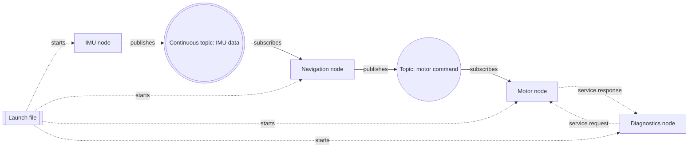
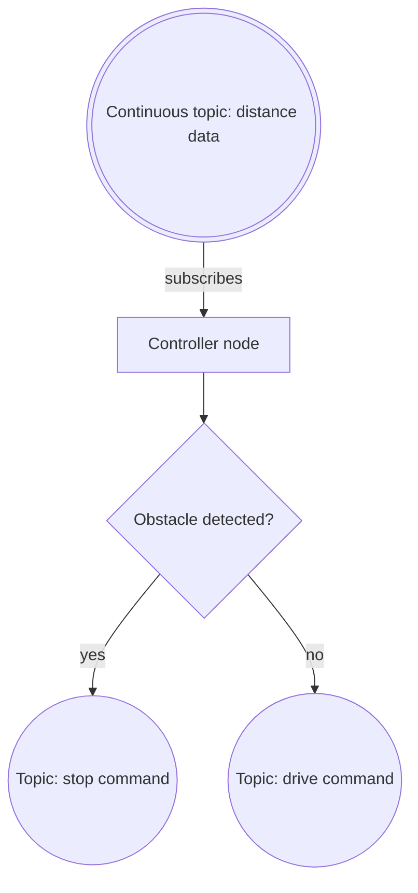

# Dann ROS 2 Graph

The **Dann ROS 2 Graph** is this course's beginner-friendly diagram convention for designing ROS 2 robot software.

It is inspired by common ROS 2 node graphs, ROS graphs, and software architecture diagrams, but **it is not an official ROS 2 standard name**. It is a course convention for making robot software easier to reason about while learning.

Start with [Lesson 0 Orientation](lessons/Lesson%200%20Orientation.md), where the first beginner version is introduced.

## Why Use It

Robotics engineers often sketch a system before writing code. A diagram helps answer:

- Which programs exist?
- Which nodes publish data?
- Which nodes subscribe to data?
- Which topics carry messages?
- Which parts use services?
- Which launch file starts the system?
- Which parts are only future work?

The goal is not to make a perfect diagram. The goal is to make the robot system understandable.

## Core Shapes

Use these shapes first. They are enough for beginner ROS 2 diagrams.

| Meaning | Shape | Mermaid example | When to use |
|---|---|---|---|
| Node or program | Rectangle | `imu_node["IMU node"]` | A running ROS 2 program with a focused job |
| Launch file | Double rectangle | `launch_file[["Launch file"]]` | A file that starts nodes together |
| Topic | Circle | `cmd_topic(("Topic: motor command"))` | A message channel |
| Continuous-data topic | Double circle | `imu_topic((("Continuous topic: IMU data")))` | Sensor-like data that updates again and again |

## Core Arrows

| Meaning | Arrow | Mermaid example | When to use |
|---|---|---|---|
| Publish to a topic | Solid arrow | `imu_node -->|publishes| imu_topic` | A node sends messages into a topic |
| Subscribe from a topic | Solid arrow | `imu_topic -->|subscribes| nav_node` | A node listens to messages from a topic |
| Service request | Dotted arrow | `diagnostics_node -.->|service request| motor_node` | One node asks another node for something |
| Service response | Dotted arrow | `motor_node -.->|service response| diagnostics_node` | The requested node replies once |
| Launch starts node | Dotted arrow | `launch_file -.->|starts| imu_node` | A launch file starts a node |

Label every arrow with an action. Good beginner labels include:

- `publishes`
- `subscribes`
- `service request`
- `service response`
- `starts`

## Beginner Example

## Advanced Shapes

Use these only when the lesson or project needs them. Do not overload beginner diagrams.

| Meaning | Shape | Mermaid example | When to use |
|---|---|---|---|
| Namespace or subsystem | Subgraph | `subgraph perception_system` | Group related nodes, such as perception, control, or diagnostics |
| Data store, log, map, or database | Cylinder | `map_store[("Map data")]` | Saved data, logs, maps, or database-like storage |
| Parameter or configuration value | Hexagon | `max_speed{{"Parameter: max_speed"}}` | A tunable value used by a node |
| Decision or control branch | Diamond | `obstacle_detected{"Obstacle detected?"}` | A logic decision, condition, or if-statement-like branch |

## About Diamonds

Yes, diamonds can be useful, but use them carefully.

A diamond means a **decision**, not a ROS 2 node. Use it when you are explaining logic inside a node or a high-level behavior flow.

Good diamond examples:

Avoid using diamonds for:

- normal ROS 2 nodes
- topics
- launch files
- services themselves

If the diagram is about ROS 2 architecture, keep diamonds rare. If the diagram is about control logic, diamonds are helpful.

## Design Rules

- Start with nodes and topics before adding services, parameters, or advanced symbols.
- Keep the graph small enough to explain out loud.
- Prefer one diagram per idea instead of one huge diagram for the entire robot.
- Use the same shape for the same meaning every time.
- Label arrows with actions, not vague words.
- Do not draw every concept as a rectangle.
- Do not make a topic look like a node.
- Do not make a service look like a node.
- If a diagram becomes crowded, split it into subsystems.

## Mermaid Safety Rules

Use GitHub and VS Code-safe Mermaid syntax:

- Prefer `flowchart LR` or `flowchart TD`.
- Use simple ASCII IDs, such as `imu_node`, `motor_topic`, and `launch_file`.
- Put readable labels in quotes when they contain spaces or punctuation.
- Avoid emojis, HTML tags, custom styling, and complicated Mermaid features in beginner lessons.
- If a Mermaid diagram breaks in preview, simplify it before adding more detail.
