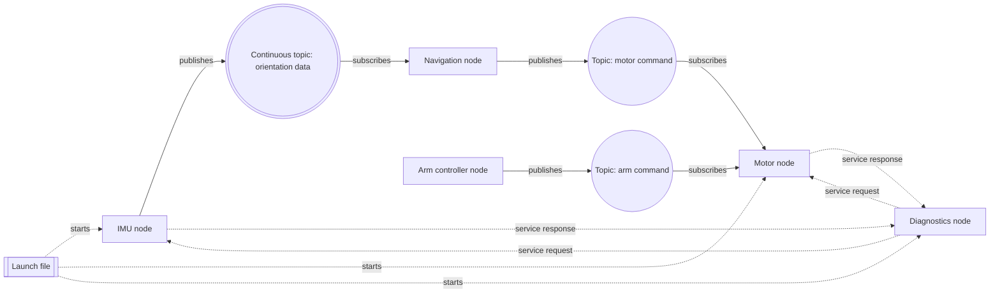

# Lesson 0 Orientation

## Source Section

- Source: `# Phase 0: Orientation`
- Roadmap summary: Introduce what ROS 2 is, why robotics software is split into cooperating nodes, and how a future agricultural rover can be understood as a graph of small programs that exchange messages.

## Lesson Purpose

This lesson gives the learner a mental model before they touch installation, workspaces, or code. A beginner can memorize commands without understanding ROS 2, so Phase 0 slows down and explains the shape of the system first: robots are usually easier to build when each job is handled by a small program, and ROS 2 helps those programs communicate.

By the end, the learner should be able to describe the future rover software stack in plain language and point to where sensors, controllers, diagnostics, parameters, and launch files will fit later in the course.

## Learning Objectives

- Explain what ROS 2 does in beginner-friendly language.
- Describe why robotics software is divided into nodes instead of one large program.
- Explain why message passing matters for robot sensors, controllers, and diagnostics.
- Compare a normal Python script with a ROS 2 program at a high level.
- Sketch a simple rover software graph using nodes, topics, services, parameters, and launch files.
- Recognize this kind of drawing as a beginner ROS 2 node graph or ROS 2 system architecture sketch.
- Identify which parts of the future rover stack will be learned later in the course.

## Prerequisite Knowledge

- Basic comfort using a computer and reading diagrams.
- A beginner-level understanding that sensors produce data and motors receive commands.
- Basic Python awareness is helpful, but no Python coding is required in this lesson.
- No prior ROS 2 experience is expected.

## Required Tools

- Paper, notebook, whiteboard, or a simple drawing app.
- Pen or pencil.
- Optional: a terminal only for showing what future ROS 2 commands will look like.

This lesson is low-storage friendly. It does not require installing ROS 2, Gazebo, RViz, Navigation2, MoveIt, Docker, YOLO, AI packages, or any full desktop robotics stack.

## Estimated Time

45 to 60 minutes for a beginner.

## Concepts to Teach

- ROS 2 as a communication framework for robot software.
- Node: one small ROS 2 program with a focused job.
- Topic: a named stream of messages, often used for continuous data.
- Publisher: a node that sends messages on a topic.
- Subscriber: a node that receives messages from a topic.
- Service: a request-and-response interaction for actions like checking diagnostics.
- Parameter: a tunable setting for a node.
- Launch file: a file that starts multiple ROS 2 pieces together.
- Distributed robotics software: robot behavior built from multiple cooperating programs, which may run in different processes or even on different computers.
- ROS 2 node graph or system architecture sketch: a diagram that shows nodes, topics, services, and launch relationships before writing code.
- Why the agricultural rover should start with a small software graph before adding heavier tools later.

## Commands to Demonstrate

```bash
ros2 node list
```

This future command will list currently running ROS 2 nodes. In this orientation lesson, it is used only as a preview of how ROS 2 lets the learner inspect the robot software graph.

```bash
ros2 topic list
```

This future command will list active topics. It helps connect the paper diagram to the idea that ROS 2 communication can be inspected from the terminal.

```bash
ros2 service list
```

This future command will list available services. It previews request-and-response communication, such as asking a diagnostics node for status.

```bash
ros2 param list
```

This future command will list parameters. It previews how robot behavior can be tuned without rewriting every program.

Do not require the learner to run these commands yet unless ROS 2 is already installed. The main goal is recognition, not execution.

## Code Artifacts to Create

- No code artifact is created in this lesson.
- `rover_software_graph` drawing: a paper or digital sketch showing the future rover as a group of communicating nodes.

## Optional Visual Aid

Use this Mermaid diagram only if it helps the learner visualize the rover as a team of small programs. The learner does not need to memorize the diagram syntax.

This kind of drawing is commonly called a **ROS 2 node graph**, **ROS graph**, or **system architecture sketch**. In professional robotics work, engineers often draw versions of this before building the software so they can reason about which programs exist and how information moves between them.

In this course, use the name **Dann ROS 2 Graph** for the beginner-friendly drawing convention. Make clear that this is a course convention, not an official ROS 2 standard name. The full diagram rulebook is in [Dann ROS 2 Graph](../Dann%20ROS%202%20Graph.md).



This is only a teaching sketch. The actual rover graph will change as the learner builds real nodes later in the course.

> **Teacher note**
>
> Use this visual convention for ROS 2 diagrams when possible: rectangles are nodes, a double rectangle is a launch file, circles are topics, a double circle is a topic that usually carries continuous data, solid arrows are topic message flow, and dotted arrows are service or launch relationships. This helps learners avoid thinking that topics and services are nodes.

> **Dann ROS 2 Graph rules**
>
> Use **rectangles** for nodes because nodes are programs. Use a **double rectangle** for launch files because they start other pieces. Use **circles** for topics because topics are message channels. Use a **double circle** for topics that usually carry continuous data, such as sensor readings. Use **solid arrows** when messages flow through a topic. Use **dotted arrows** for relationships that are not topic streams, such as service requests, service responses, or launch files starting nodes. Label every arrow with the action, such as `publishes`, `subscribes`, `service request`, `service response`, or `starts`.

## Learner Activities

- Explain in their own words why a rover should not be built as one giant program.
- Match common rover jobs to possible ROS 2 nodes, such as an IMU node, motor node, arm controller node, diagnostics node, navigation node, and future vision node.
- Draw arrows from sensor publishers to controller subscribers.
- Mark which connections are continuous data streams and which are request-and-response interactions.
- Label at least two parameters that might tune rover behavior, such as `max_speed` or `diagnostic_rate`.
- Explain that robotics engineers often make node graphs or architecture sketches before coding to clarify system design.
- Discuss which heavy tools are intentionally postponed until after fundamentals.

## Simple Exercise or Mini-Project

Create a paper or digital Dann ROS 2 Graph for a **Tiny Distance Stop System**.

- Task: Design a tiny rover system where a distance sensor helps the rover decide when to stop.
- Required nodes: `distance_sensor_node`, `stop_controller_node`, `motor_node`, and `tiny_rover_launch`.
- Success criteria: The learner adds topics, arrows, and labels using the Dann ROS 2 Graph rules, and can explain which node senses distance, which node decides what to do, and which node receives the motor command.
- Hint: Give only the system name and nodes. Let the learner design the connections like a robotics engineer.

## Verification Checks

- The learner can point to one node and explain its job in one sentence.
- The learner can point to one arrow and explain what message might travel along it.
- The learner can explain the difference between a continuous topic and a request-and-response service.
- The learner can name at least one reason this course starts with lightweight ROS 2 fundamentals instead of Gazebo, Navigation2, MoveIt, Docker, or AI packages.
- The learner can answer the checkpoint questions without needing exact memorized wording.

## Beginner Mistakes to Watch For

- Thinking ROS 2 is the robot itself instead of software infrastructure for robot programs.
- Thinking every robot behavior should go into one large Python file.
- Confusing a node with a topic.
- Thinking a topic is a command typed in the terminal instead of a named message stream.
- Assuming advanced tools like Gazebo or Navigation2 are required before learning ROS 2 basics.
- Treating the rover graph as final architecture instead of a learning sketch that will become clearer over time.
- Drawing every ROS 2 concept as the same shape, which can make nodes, topics, services, and launch files look like the same kind of thing.

## Troubleshooting Topics

| Symptom | Likely cause | Fix | Verification |
|---|---|---|---|
| Learner cannot explain what ROS 2 does | The explanation became too abstract | Reframe ROS 2 as a way for small robot programs to find each other and exchange messages | Learner can describe ROS 2 without using unexplained jargon |
| Learner draws one giant rover program | They are used to simple scripts | Ask them to split the rover by jobs: sensing, control, diagnostics, tuning, startup | Diagram has multiple named nodes |
| Learner confuses topics and services | Both sound like communication | Use timing: topics are ongoing streams, services are ask-and-answer interactions | Learner labels one stream and one request-response connection correctly |
| Learner wants to install simulation tools immediately | They associate robotics with visual simulation | Explain that fundamentals can be learned with small nodes and terminal checks first | Learner can explain why heavy tools are future work |
| Learner feels the graph is too theoretical | There is no visible robot yet | Tie each node to a real rover job, such as reading an IMU or commanding motors | Learner can connect each node to physical rover behavior |

## Checkpoint Questions

- What problem does ROS 2 help solve in robot software?
- Why is a rover usually easier to understand as several small nodes instead of one large program?
- What is one example of a sensor publisher on the rover?
- What is one example of a controller subscriber on the rover?
- What is the difference between a topic and a service?
- What might a parameter be used for on the rover?
- Why does this course postpone tools like Gazebo, Navigation2, MoveIt, Docker, and YOLO?

## Teacher Notes

Teach this lesson slowly and concretely. The goal is not to make the learner fluent in every ROS 2 term yet. The goal is to give them a first map of the territory so later commands have somewhere to land.

Use the rover analogy often. A beginner may understand "the IMU node reports orientation" faster than "a publisher emits messages on a topic." Start with the robot job, then introduce the ROS 2 word.

Avoid turning this into an installation lesson. If ROS 2 commands are shown, present them as previews of future verification tools. The learner should leave Phase 0 curious and oriented, not overwhelmed by setup details.

Keep heavy tools clearly labeled as future work. Explain that postponing them is a strength of the course because the learner will first build the habits needed to debug a real ROS 2 graph from the terminal.

If a learner asks about deeper topics such as custom messages, launch file details, rqt graphs, Navigation2, Gazebo, MoveIt, Docker, or AI vision, respond respectfully and briefly. A good pattern is: "That's a good question. We will study that properly later, so you do not need to master it yet. For now, the short version is..." Then return to the Phase 0 goal: understanding why ROS 2 uses small programs that communicate.
