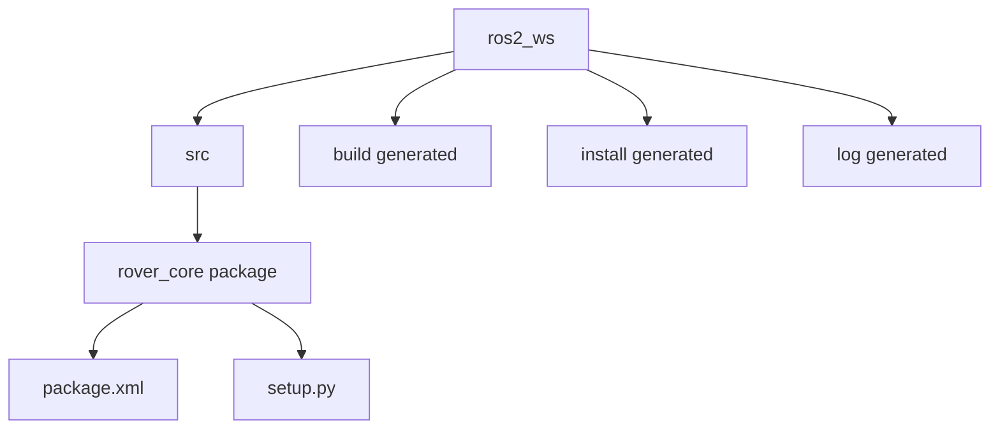

# Lesson 1 Installation, Workspace, and Package Mechanics

## Source Section

- Source: `# Phase 1: Installation, Workspace, and Package Mechanics`
- Roadmap summary: Complete the existing lightweight ROS 2 Jazzy installation guide, learn why terminal environment setup matters, create the `ros2_ws` learning workspace, build it with `colcon`, and create the first Python package named `rover_core`.

## Lesson Purpose

This lesson turns ROS 2 from an idea into a working terminal environment. The installation itself should already be handled by the course installation guide. The learner should finish this lesson with a clean ROS 2 learning workspace and a first package that ROS 2 can discover.

The main teaching goal is confidence. Beginners often feel that setup errors mean they are bad at ROS 2, but many early problems come from environment sourcing, folder layout, or building from the wrong directory. This lesson should make those mechanics visible and testable.

By the end, the learner should understand that a ROS 2 project is not just one random Python file. It lives inside a workspace, source code belongs in `src/`, packages provide organized units of robot behavior, and terminal environment setup tells ROS 2 where to find everything.

The workspace name is `ros2_ws` on purpose. This course is about mastering ROS 2 first. The future agricultural rover and thesis work give the learning a direction, but the early lessons should feel like ROS 2 fundamentals, not thesis implementation.

## Learning Objectives

- Explain what a ROS 2 distribution is and why this course uses ROS 2 Jazzy on Ubuntu 24.04.
- Complete the existing lightweight ROS 2 Jazzy installation guide before starting workspace work.
- Explain what `source /opt/ros/jazzy/setup.bash` does in beginner-friendly language.
- Verify that ROS 2 commands are available in a terminal.
- Create a ROS 2 workspace named `ros2_ws`.
- Explain why ROS 2 source packages go inside `ros2_ws/src/`.
- Build an empty workspace with `colcon build`.
- Source the local workspace with `source install/setup.bash`.
- Create a Python package named `rover_core`.
- Identify the purpose of `package.xml`, `setup.py`, and package dependencies at a beginner level.
- Confirm that ROS 2 can discover the new package.

## Prerequisite Knowledge

- The learner can open a terminal.
- The learner can create folders and move between folders with `cd`.
- The learner has basic Python awareness, but does not need to write a ROS 2 node yet.
- The learner understands from Lesson 0 that ROS 2 programs are organized into smaller pieces that will communicate later.
- The learner should already have followed the installation guide or be ready to pause and complete it first.

## Required Tools

- Ubuntu 24.04 LTS.
- ROS 2 Jazzy base installation, preferably `ros-jazzy-ros-base`.
- Completed setup from `Installation-Guides/01 ROS 2 Jazzy Base Install and Verification.md`.
- Terminal.
- Text editor such as VS Code, nano, or another beginner-friendly editor.
- Git, if the learner is syncing code between macOS and Ubuntu.
- `colcon` build tools.
- Python 3.

This lesson is low-storage friendly. It intentionally uses ROS 2 base, terminal commands, and small package mechanics. It does not require Gazebo, RViz, Navigation2, MoveIt, Docker, YOLO, AI packages, large simulation worlds, or the full ROS desktop stack.

## Authoring and VM Workflow

This course may be edited on macOS with Codex or Claude while ROS 2 runs inside an Ubuntu VM. That is a good workflow, but the cleanest sync method for code is Git, not building directly from the shared folder.

A shared folder, such as the Spice client folder shown in the author's setup, is useful for quick file transfer, screenshots, and reading notes. It should not be the main place where beginner ROS 2 workspaces are built.

For this beginner lesson, keep the actual ROS 2 workspace inside Ubuntu:

```bash
~/ros2_ws
```

Do not require learners to build the ROS 2 workspace inside the shared course folder. Shared folders are useful for course authoring, but `colcon build` is easier to troubleshoot from a normal Ubuntu home-folder workspace.

**Recommended workflow:** edit lessons on macOS, save work with Git, pull or fetch the same work inside Ubuntu, run ROS 2 commands in the Ubuntu terminal, and build practice packages in `~/ros2_ws`.

Install Git in Ubuntu if needed:

```bash
sudo apt update
sudo apt install git
```

> **Teacher note**
>
> If a learner asks why Git is better than a shared folder for ROS 2 code, explain that Git gives a clear history and avoids VM shared-folder issues such as permission differences, slower file access, symlink behavior, and paths with spaces. The shared folder is still useful for quick transfers and screenshots.

> **Teacher note**
>
> If the learner asks why the course does not install `ros-jazzy-desktop`, acknowledge that it is a good question. For now, the short version is that ROS 2 fundamentals can be learned with much less storage. GUI and simulation tools come later only when they solve a learning problem.

## Estimated Time

45 to 75 minutes for a beginner after the installation guide has already been completed.

If ROS 2 Jazzy is not installed yet, pause this lesson and complete `Installation-Guides/01 ROS 2 Jazzy Base Install and Verification.md` first.

## Concepts to Teach

- **ROS 2 distribution:** A named ROS 2 release, such as Jazzy, matched to a supported Ubuntu version.
- **Environment sourcing:** A terminal setup step that teaches the current terminal where ROS 2 commands and packages live.
- **Terminal session:** One open terminal window or tab. Sourcing one terminal does not automatically source every other terminal.
- **Workspace:** A project folder where the learner builds their own ROS 2 packages.
- **`src/` folder:** The place where source packages live inside a workspace.
- **`colcon build`:** The command that builds packages in a ROS 2 workspace.
- **`build/`, `install/`, and `log/`:** Generated folders created by the build process.
- **System ROS packages vs learner packages:** ROS 2 packages installed under `/opt/ros/jazzy` are system packages; packages in `ros2_ws/src/` are the learner's practice packages.
- **Package:** A reusable unit of ROS 2 code, metadata, dependencies, and executable entry points.
- **`package.xml`:** Metadata and dependency information for a ROS 2 package.
- **`setup.py`:** Python packaging setup used to install Python code and console scripts.
- **Dependency:** Another package or library that the current package needs.
- **Console script:** A named terminal command that can later run a Python ROS 2 node.

### Mental Models to Build

- **Workspace means practice garage:** The workspace is the learner's ROS 2 practice garage. The `src/` folder is where packages are stored and worked on.
- **Sourcing means giving directions:** `source /opt/ros/jazzy/setup.bash` gives the terminal directions to the system ROS 2 installation. `source install/setup.bash` gives it directions to the learner's local workspace.
- **Package means labeled toolbox:** `rover_core` is not the rover itself. It is a labeled toolbox where related rover code will live.
- **Build means prepare for discovery:** `colcon build` does not just "run code." It prepares packages so ROS 2 can discover and use them.

## Commands to Demonstrate

Before this lesson, ask learners to complete:

```text
Installation-Guides/01 ROS 2 Jazzy Base Install and Verification.md
```

This lesson should not duplicate the full installation guide. It should only verify that the environment is ready and then focus on workspace and package mechanics.

```bash
source /opt/ros/jazzy/setup.bash
```

Set up the current terminal so ROS 2 Jazzy commands and system packages can be found.

```bash
ros2 --help
```

Check that the `ros2` command exists. A success sign is seeing help text instead of `command not found`.

```bash
ros2 pkg list
```

List visible ROS 2 packages. This proves the sourced terminal can see installed ROS 2 packages.

```bash
mkdir -p ~/ros2_ws/src
```

Create the workspace and its `src/` folder. This creates the folder layout that future rover packages will use.

```bash
cd ~/ros2_ws
```

Move into the workspace root. This matters because `colcon build` should be run from the workspace root, not from inside `src/`.

```bash
colcon build
```

Build the workspace. For an empty workspace, this proves the build tool works and creates `build/`, `install/`, and `log/`.

```bash
source install/setup.bash
```

Set up the current terminal to see packages from the local workspace.

```bash
cd ~/ros2_ws/src
```

Move into the source folder before creating a package. This keeps the package in the correct place.

```bash
ros2 pkg create rover_core --build-type ament_python --dependencies rclpy
```

Create the first Python ROS 2 package. `rclpy` is the Python client library used later to write ROS 2 nodes.

```bash
cd ~/ros2_ws
colcon build
source install/setup.bash
```

Build the workspace again and source the result so ROS 2 can discover `rover_core`.

```bash
ros2 pkg list | grep rover_core
```

Verify that ROS 2 can see the new package. The success sign is seeing `rover_core` printed.

```bash
ros2 pkg prefix rover_core
```

Show where ROS 2 finds the installed version of the package. This helps the learner connect package discovery to the `install/` folder.

## Code Artifacts to Create

- `~/ros2_ws/`: The learner's ROS 2 practice workspace for this course.
- `~/ros2_ws/src/`: The source folder where learner-created ROS 2 packages live.
- `~/ros2_ws/src/rover_core/`: The first Python ROS 2 package with future rover context.
- `~/ros2_ws/src/rover_core/package.xml`: Package metadata and dependencies.
- `~/ros2_ws/src/rover_core/setup.py`: Python package installation and future console script configuration.
- `~/ros2_ws/build/`: Generated build files. Do not edit manually.
- `~/ros2_ws/install/`: Generated installed workspace files. Source this after building.
- `~/ros2_ws/log/`: Generated build logs useful for troubleshooting.

No custom Python node is required in this lesson. Node coding starts in Phase 2.

## Workspace Layout Visual Aid

Use this diagram to explain the physical folder structure. This is not a ROS 2 node graph; it is just a workspace layout diagram.



**How to read this:** `ros2_ws` is the workspace root. The learner writes or creates packages inside `src/`. The `build/`, `install/`, and `log/` folders are generated by `colcon build`.

## Learner Activities

- Run the ROS 2 source command and explain why it only affects the current terminal.
- Check `ros2 --help` before and after sourcing if ROS 2 is not automatically sourced.
- Create `~/ros2_ws/src` and describe why source code belongs in `src/`.
- Build an empty workspace and inspect the generated folders.
- Source the local workspace and explain the difference between system ROS and local workspace setup.
- Create the `rover_core` package and identify the generated files.
- Rebuild the workspace and verify package discovery with `ros2 pkg list`.
- Explain the workspace layout out loud in one or two minutes.

## Simple Exercise or Mini-Project

Create a **First Rover Workspace Check**.

- **Task:** Set up the `ros2_ws` workspace, create the `rover_core` package, build it, source it, and prove ROS 2 can find it.
- **Required parts:** `ros2_ws`, `src/`, `rover_core`, successful `colcon build`, and one ROS 2 CLI verification command.
- **Success criteria:** `ros2 pkg list | grep rover_core` prints `rover_core`, and `ros2 pkg prefix rover_core` points to the workspace install location.
- **Hint:** If ROS 2 cannot find the package after a successful build, check whether the learner sourced both `/opt/ros/jazzy/setup.bash` and `~/ros2_ws/install/setup.bash` in the current terminal.
- **What the learner should decide on their own:** Which command output is the strongest proof that their package is visible to ROS 2, and how they would explain that proof to another beginner.
- **One-minute explanation:** Ask the learner to explain what they created, what `colcon build` generated, and how they proved `rover_core` is visible.

## Verification Checks

- `ros2 --help` shows ROS 2 command help.
- `ros2 pkg list` prints many installed ROS 2 packages.
- `~/ros2_ws/src` exists.
- Running `colcon build` from `~/ros2_ws` completes without errors.
- `~/ros2_ws/build`, `~/ros2_ws/install`, and `~/ros2_ws/log` exist after building.
- `source ~/ros2_ws/install/setup.bash` runs without output or errors.
- `~/ros2_ws/src/rover_core/package.xml` exists.
- `~/ros2_ws/src/rover_core/setup.py` exists.
- `ros2 pkg list | grep rover_core` prints `rover_core`.
- `ros2 pkg prefix rover_core` points to a path under `~/ros2_ws/install/rover_core`.

> **Student note**
>
> A command that succeeds silently is not always broken. Some setup commands, especially `source`, usually do not print anything when they work.

## Beginner Mistakes to Watch For

- Opening a new terminal and forgetting to source ROS 2 again.
- Running `colcon build` from inside `src/` instead of from the workspace root.
- Creating `rover_core` outside `~/ros2_ws/src`.
- Forgetting to rebuild after creating a package.
- Forgetting to source `install/setup.bash` after building.
- Expecting `source install/setup.bash` to print a success message.
- Thinking `build/`, `install/`, or `log/` should be edited manually.
- Installing the full desktop stack or simulation tools too early because robotics feels incomplete without graphics.
- Confusing a package with a node. The package is a container for code; nodes are programs that will be written later.
- Confusing package creation with running robot behavior. A new package may contain no useful node yet, and that is normal.

## Troubleshooting Topics

| Symptom | Likely cause | Fix | Verification |
|---|---|---|---|
| `ros2: command not found` | ROS 2 environment was not sourced in this terminal, or ROS 2 is not installed | Run `source /opt/ros/jazzy/setup.bash`; if the file does not exist, complete the installation guide first | `ros2 --help` shows help text |
| `colcon: command not found` | `colcon` tools are not installed or the installation guide was not completed | Return to the installation guide and install the listed build tools | `colcon --help` shows help text |
| `colcon build` finds no packages after creating `rover_core` | Package was created outside `~/ros2_ws/src` or build ran from the wrong location | Move or recreate the package under `~/ros2_ws/src`, then run `colcon build` from `~/ros2_ws` | `find ~/ros2_ws/src -maxdepth 2 -name package.xml` shows the package metadata |
| `ros2 pkg list | grep rover_core` prints nothing | Workspace was built but not sourced, or the current terminal is not using the workspace | Run `cd ~/ros2_ws`, then `source install/setup.bash` | `ros2 pkg prefix rover_core` prints an install path |
| Learner edits files in `install/` | They think generated files are the source files | Explain that source files live in `src/`; generated folders can be recreated by building | Changes are made under `~/ros2_ws/src/rover_core` |
| `source install/setup.bash` says file not found | Workspace has not been built yet, or learner is in the wrong folder | Run `colcon build` from `~/ros2_ws`, then source using the correct path | `ls ~/ros2_ws/install/setup.bash` shows the file |
| Learner expects a visible robot or simulation | They associate ROS 2 with graphics or Gazebo | Explain that this lesson proves the software foundation first; visual tools come later after fundamentals | Learner can state what was verified without a simulator |

## Checkpoint Questions

- What is a ROS 2 distribution?
- Why does this course use ROS 2 Jazzy with Ubuntu 24.04?
- What does `source /opt/ros/jazzy/setup.bash` do for the current terminal?
- Why might `ros2` work in one terminal but not another?
- What is a ROS 2 workspace?
- Why does `ros2_ws` need a `src/` folder?
- What does `colcon build` create?
- What is the difference between `/opt/ros/jazzy` and `~/ros2_ws`?
- What is a ROS 2 package?
- What is `rover_core` for in this course?
- Which command proves that ROS 2 can see the `rover_core` package?
- Why are Gazebo, Navigation2, MoveIt, Docker, and YOLO not installed in this beginner lesson?

## Teacher Notes

Teach this lesson as a sequence of small proofs. First prove ROS 2 exists. Then prove the workspace can build. Then prove the package can be discovered. Each proof should have a visible command or file check.

Emphasize that sourcing is not magic. It changes environment variables in the current terminal so commands and packages can be found. A useful analogy is giving the terminal a map: first a map to system ROS 2, then a map to the learner's workspace.

Slow down around `colcon build`. Beginners may think building means running the robot. Explain that building prepares the workspace and creates installed package files. The robot behavior comes later when nodes are written.

Explain generated folders with care:

- `src/` is where the learner works.
- `build/` is temporary build work.
- `install/` is what the workspace exposes after building.
- `log/` records what happened during the build.

> **Teacher note**
>
> If a learner asks why there is no node yet, say: "That's a good question. We will study nodes properly in Phase 2. For now, the short version is that a package is the container, and a node is a program that can live inside it."

> **Teacher note**
>
> If a learner asks about topics, publishers, or subscribers while creating `rover_core`, say: "That's a good question. Topics are taught in Phase 4. For now, remember that `rover_core` is where some future publisher and subscriber code may live."

> **Teacher note**
>
> If a learner asks about launch files, say: "That's a good question. Launch files are taught in Phase 8. For now, the short version is that launch files help start multiple ROS 2 programs together, but this lesson only needs one workspace and one package."

> **Teacher note**
>
> If a learner asks about `rqt_graph`, say: "That's a good question. We will use `rqt_graph` in Phase 3 after there are running nodes to inspect. For now, the terminal is enough to verify package discovery."

> **Teacher note**
>
> If a learner asks about Gazebo, Navigation2, MoveIt, Docker, YOLO, or AI vision, say: "That's a good question, but students do not need to master it yet. Those belong after the ROS 2 fundamentals, and some are outside this ROS 2-only course. For now, the short version is that they are powerful tools built on top of basics like workspaces, packages, nodes, topics, services, parameters, and launch files."

Watch for wrong-but-reasonable interpretations:

- A learner may think a workspace is a ROS 2 installation. Clarify that ROS 2 itself is installed under `/opt/ros/jazzy`; the workspace is where their project code lives.
- A learner may think `source` permanently fixes every terminal. Clarify that it affects the current terminal session unless added to shell startup files later.
- A learner may think an empty workspace build is pointless. Clarify that it proves `colcon` works before adding complexity.
- A learner may think package creation should produce visible robot behavior. Clarify that package mechanics come before node behavior.

The actual lesson should include short pauses after command output. Ask the learner what they see before explaining it. This helps them build debugging confidence instead of just copying commands.

## Student Pacing Review

Current matched section: `# Phase 1: Installation, Workspace, and Package Mechanics`.

Future topics mentioned but not taught deeply:

- Nodes belong in Phase 2.
- CLI inspection and `rqt_graph` belong in Phase 3.
- Topics, publishers, and subscribers belong in Phase 4.
- Launch files belong in Phase 8.
- Heavy robotics tools belong after fundamentals or future courses.

Each future topic is handled with a short teacher note that acknowledges the question, gives a beginner-safe summary, and returns focus to installation, workspace layout, and package mechanics.

## Mermaid Verification

This lesson plan includes one Mermaid diagram for workspace folder layout.

Manual verification pass:

- The fenced block starts with ` ```mermaid ` and ends with ` ``` `.
- The diagram uses `flowchart TD`.
- Node IDs use simple ASCII words with underscores.
- Labels with spaces are quoted inside brackets.
- Arrows use simple `-->` syntax.
- There are no custom styles, HTML tags, emojis, or advanced Mermaid features.

The Mermaid diagram is GitHub and VS Code Markdown preview safe.
