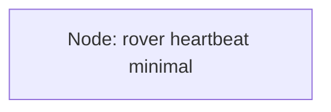

# Phase2 Lesson 2 Python Node, Minimal Code First

## Source Section

- Source: `## Section 2.2: Python Node, Minimal Code First`
- Roadmap summary: Teach the smallest possible procedural Python ROS 2 node using `rclpy.init()`, node creation, logging, spinning, and clean shutdown. The rover mini-project is `rover_heartbeat_minimal`, which prints a heartbeat message every second.

## Lesson Purpose

This lesson turns the learner's first package from Lesson 1 into a running ROS 2 program.

The learner has already practiced workspace and package mechanics. Now they need to see the smallest Python code pattern that makes a ROS 2 node come alive. Keep the lesson deliberately small: one package, one Python file, one console script, one node name, one heartbeat log.

The main teaching purpose is to separate three ideas that beginners often blur together:

- A **workspace** holds packages.
- A **package** organizes code.
- A **node** is the running program ROS 2 can see.

This lesson should build confidence before class-based nodes, timers, topics, services, parameters, launch files, or graphical tools.

## Learning Objectives

- Explain what a minimal Python ROS 2 node is.
- Explain what `rclpy.init()` does at a beginner level.
- Create a node using procedural Python, without classes.
- Use a ROS 2 logger instead of plain `print()`.
- Keep a node alive using a simple spin loop.
- Stop a node cleanly with `Ctrl+C`.
- Register a Python node as a console script in `setup.py`.
- Build and source the workspace after changing a console script.
- Run the node with `ros2 run`.
- Verify that the node is alive with `ros2 node list` and `ros2 node info`.

## Prerequisite Knowledge

- The learner completed Lesson 1 or already has `~/ros2_ws`.
- The learner has a Python package named `rover_core`.
- The learner can open a terminal and move around with `cd`.
- The learner knows basic Python imports, functions, loops, and indentation.
- The learner understands from Section 2.1 that a node is a running ROS 2 program with a focused job.
- The learner does not need to understand classes, timers, publishers, subscribers, services, parameters, or launch files yet.

## Required Tools

- Ubuntu 24.04 LTS.
- ROS 2 Jazzy base installation.
- `~/ros2_ws` workspace.
- `rover_core` Python package.
- Terminal.
- Text editor such as nano, VS Code, or another beginner-friendly editor.
- `colcon` build tools.
- Python 3 with `rclpy` available through ROS 2 Jazzy.

This lesson is low-storage friendly. It uses only terminal commands, one Python node file, and the existing ROS 2 base installation. It does not require Gazebo, Navigation2, MoveIt, Docker, YOLO, AI packages, large simulation worlds, or the full desktop stack.

> **Teacher note**
>
> Keep the lesson in the Ubuntu ROS 2 environment. If the author is editing course material on macOS, remind learners that the actual ROS 2 workspace should be built and tested inside Ubuntu.

## Estimated Time

45 to 70 minutes for a beginner.

Allow extra time if the learner has never edited `setup.py` or if their terminal environment is not being sourced automatically.

## Concepts to Teach

- **Minimal node:** A small running ROS 2 program with only the code needed to start, log, stay alive, and shut down.
- **`rclpy`:** The Python client library for ROS 2.
- **`rclpy.init()`:** The startup call that prepares Python code to participate in ROS 2.
- **Node creation:** `rclpy.create_node("node_name")` gives the program a ROS 2 identity.
- **Node name:** The name that appears in ROS 2 CLI tools while the program is running.
- **Logger:** ROS 2-aware message output through `node.get_logger().info(...)`.
- **Spin:** The process of letting ROS 2 handle work for a node.
- **`rclpy.ok()`:** A loop condition that stays true while ROS 2 is still running normally.
- **Shutdown:** The cleanup step using `node.destroy_node()` and `rclpy.shutdown()`.
- **Console script:** The `setup.py` entry point that connects a terminal command to a Python function.
- **Build and source cycle:** After changing package entry points, the learner must rebuild and source the workspace.

### Mental Models to Build

- **Node means living program:** A node is not just a file on disk. It is the running program ROS 2 can discover.
- **Package means home folder:** `rover_core` is the home for related rover code, not the node itself.
- **Logger means ROS 2-friendly print:** Logging gives messages a node name, timestamp, and severity level.
- **Spin means stay available:** For now, spinning keeps the node alive. Later it will process timers, topic messages, service requests, and other callbacks.
- **Console script means front door:** `setup.py` creates a named front door so `ros2 run` can start the Python function.

### Suggested Tiny Diagram

Use a very small Dann ROS 2 Graph if a visual helps.



In the actual lesson, explain:

- This is a Dann ROS 2 Graph, a course convention and not an official ROS 2 standard name.
- The rectangle represents one running node.
- There are no topics or services in this lesson yet.
- The diagram is intentionally tiny because the learning target is one node.

## Commands to Demonstrate

```bash
echo $ROS_DISTRO
```

Proves whether the terminal already knows which ROS 2 distribution is active. Expected success sign: `jazzy`.

```bash
source /opt/ros/jazzy/setup.bash
```

Sets up ROS 2 Jazzy in the current terminal if `echo $ROS_DISTRO` is blank. Explain that blank output is normal when sourcing succeeds.

```bash
cd ~/ros2_ws
```

Moves to the workspace root. This matters because `colcon build` should be run from the workspace root.

```bash
ls src/rover_core
```

Checks that the package from Lesson 1 exists. Expected success sign: files such as `package.xml`, `setup.py`, and the `rover_core` Python folder.

```bash
cd ~/ros2_ws/src/rover_core/rover_core
```

Moves into the Python module folder where the node file should be created.

```bash
nano rover_heartbeat_minimal.py
```

Creates or edits the minimal Python node file. If using another editor, keep the same file path.

```bash
cd ~/ros2_ws/src/rover_core
nano setup.py
```

Opens the Python package setup file so the console script can be registered.

```bash
cd ~/ros2_ws
colcon build --packages-select rover_core
```

Builds only the `rover_core` package. Expected success sign: `Finished <<< rover_core`.

```bash
source install/setup.bash
```

Makes the newly built console script visible to the current terminal. Explain that this must happen after building.

```bash
ros2 run rover_core rover_heartbeat_minimal
```

Runs the node. Expected success sign: heartbeat log messages appear about once per second.

```bash
ros2 node list
```

Verifies that ROS 2 can see the running node. Expected success sign: `/rover_heartbeat_minimal`.

```bash
ros2 node info /rover_heartbeat_minimal
```

Inspects the running node. The learner may see built-in publishers, services, or clients. Keep this explanation short and defer communication details to later phases.

## Code Artifacts to Create

- `~/ros2_ws/src/rover_core/rover_core/rover_heartbeat_minimal.py`: The procedural minimal Python ROS 2 node.
- `~/ros2_ws/src/rover_core/setup.py`: Updated to register `rover_heartbeat_minimal` as a console script.

### Minimal Code Pattern to Teach

Use this code as the planned student-facing example:

```python
import rclpy


def main(args=None):
    rclpy.init(args=args)

    node = rclpy.create_node("rover_heartbeat_minimal")

    try:
        while rclpy.ok():
            node.get_logger().info("Rover heartbeat: core system is alive")
            rclpy.spin_once(node, timeout_sec=1.0)
    except KeyboardInterrupt:
        pass
    finally:
        node.destroy_node()
        if rclpy.ok():
            rclpy.shutdown()


if __name__ == "__main__":
    main()
```

Use this console script entry:

```python
'rover_heartbeat_minimal = rover_core.rover_heartbeat_minimal:main',
```

## Learner Activities

- Identify where the node file belongs inside the package.
- Type or paste the minimal procedural Python node.
- Explain each important line in plain language.
- Add the console script entry to `setup.py`.
- Build only `rover_core`.
- Source the workspace after building.
- Run the heartbeat node.
- Open a second terminal and verify the node with ROS 2 CLI.
- Stop the node cleanly with `Ctrl+C`.
- Explain the difference between package name, command name, and node name.

## Simple Exercise or Mini-Project

### Mini-Project: Rover Status Beacon

**Task:** Create a second minimal procedural node named `rover_status_beacon`.

**Goal:** The node should log a status message about every two seconds.

**Required parts:**

- A new Python file inside `~/ros2_ws/src/rover_core/rover_core/`.
- A new console script entry in `setup.py`.
- A node name such as `rover_status_beacon`.
- A log message that includes the word `status`.
- A loop delay of about two seconds.
- Build, source, run, and CLI verification.

**Success criteria:**

- `ros2 run rover_core rover_status_beacon` starts successfully.
- A status message appears about every two seconds.
- `ros2 node list` shows `/rover_status_beacon` while it is running.

**Hint:** Reuse the heartbeat pattern, but change the file name, node name, command name, message text, and `timeout_sec`.

**What the learner should decide on their own:**

- The exact message text.
- Whether the status sounds like a battery check, readiness check, or general health check.

**One-minute explanation prompt:** Ask the learner to explain what the package is, what the node is, what command runs it, and how they proved it was alive.

## Verification Checks

- `echo $ROS_DISTRO` prints `jazzy`.
- `ls src/rover_core` shows the package folder from Lesson 1.
- `colcon build --packages-select rover_core` finishes without failed packages.
- `source install/setup.bash` runs with no error output.
- `ros2 run rover_core rover_heartbeat_minimal` prints heartbeat messages about once per second.
- `ros2 node list` shows `/rover_heartbeat_minimal` while the node is running.
- `ros2 node info /rover_heartbeat_minimal` returns node information instead of an error.
- Pressing `Ctrl+C` stops the node without a confusing Python traceback.

## Beginner Mistakes to Watch For

- Creating the Python file in the wrong folder.
- Editing `setup.py` from the wrong package.
- Forgetting the comma after the console script line.
- Misspelling the Python module path in the console script.
- Rebuilding from inside `src/` or inside the package folder instead of `~/ros2_ws`.
- Forgetting to source `install/setup.bash` after building.
- Running `ros2 node list` after the node has already been stopped.
- Confusing the package name `rover_core` with the node name `rover_heartbeat_minimal`.
- Expecting custom topics to appear even though this lesson has not introduced publishers or subscribers yet.
- Thinking a blank `source` command means something failed.

## Troubleshooting Topics

| Symptom | Likely cause | Fix | Verification |
|---|---|---|---|
| `ros2: command not found` | ROS 2 is not sourced | Run `source /opt/ros/jazzy/setup.bash` | `echo $ROS_DISTRO` prints `jazzy` |
| `Package 'rover_core' not found` | Workspace is not built or sourced | Build from `~/ros2_ws`, then run `source install/setup.bash` | `ros2 pkg list \| grep rover_core` prints `rover_core` |
| `No executable found` | Console script entry is missing, misspelled, or not rebuilt | Fix `setup.py`, rebuild, and source again | `ros2 run rover_core rover_heartbeat_minimal` starts |
| Build fails with syntax error | Python file or `setup.py` has a typo | Read the line number in the error and fix the typo | Build finishes with `Finished <<< rover_core` |
| `ros2 node list` is empty | Node is not currently running or the second terminal is not sourced | Keep Terminal 1 running the node and source Terminal 2 | `/rover_heartbeat_minimal` appears |
| Heartbeat messages do not repeat | Loop or `spin_once` call was changed | Restore the `while rclpy.ok()` loop and `spin_once` call | Logs repeat about once per second |
| Program exits immediately | The node is not kept alive | Add the loop that calls `rclpy.spin_once(...)` | The command keeps running until `Ctrl+C` |
| `rcl_shutdown already called` appears after `Ctrl+C` | The code tried to shut down ROS 2 after it was already shutting down | Guard `rclpy.shutdown()` with `if rclpy.ok():` | The node stops cleanly after `Ctrl+C` |

## Checkpoint Questions

- What is the difference between `rover_core` and `rover_heartbeat_minimal`?
- What does `rclpy.init()` prepare?
- Why does the node need a name?
- Why use `node.get_logger().info(...)` instead of plain `print()`?
- What does spinning do in beginner language?
- Why do we rebuild after changing `setup.py`?
- Why do we source `install/setup.bash` after building?
- How can you prove the node is alive using ROS 2 CLI?
- Why are classes intentionally avoided in this lesson?

## Teacher Notes

Teach this as one tiny success, not as a complete explanation of ROS 2 architecture.

**Likely learner question:** "Why are we not using classes?"

Answer gently: classes are the common ROS 2 Python style, and they are coming in Section 2.3. For now, procedural code makes the startup pattern easier to see.

**Likely learner question:** "Why does `ros2 node info` show publishers or services if we did not create any?"

> **Teacher note**
>
> This is a good question, but students do not need to master it yet. Topics will be taught in Phase 4 and services in Phase 5. For now, the short version is that ROS 2 nodes can expose some built-in communication pieces for ROS 2 internals. Keep the focus on proving the node is alive.

**Likely learner question:** "Is `spin_once` the normal way to run repeating work?"

> **Teacher note**
>
> This is a good question, but students do not need to master timers yet. Section 2.3 introduces the class-based node pattern, and timers become clearer there and in later publisher lessons. For now, `spin_once` gives a simple visible heartbeat without introducing callbacks too deeply.

**Wrong-but-reasonable interpretation:** The learner may think the Python file name, console script name, and node name must always be identical.

Explain that they can differ, but keeping them similar in beginner lessons reduces confusion. Distinguish them clearly:

- File name: where the code lives.
- Console script name: what `ros2 run` starts.
- Node name: what `ros2 node list` sees while the program is alive.

**Wrong-but-reasonable interpretation:** The learner may think `source install/setup.bash` is a build command.

Explain that build prepares files, while source teaches the current terminal where to find them.

**Student-note callouts to add in the actual lesson:**

- Blank output after `source` is normal.
- `Ctrl+C` is the expected way to stop this node.
- No topics yet. That is intentional.
- The package is not the node.
- The first goal is a node that stays alive and is visible to ROS 2.

**Pacing reminder:** Avoid explaining publishers, subscribers, services, launch files, parameters, lifecycle nodes, callback groups, executors, or DDS in depth. Give only a short bridge if asked, then return to the heartbeat node.
