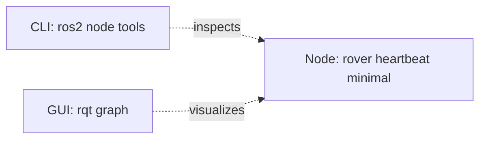

# Lesson 3 ROS 2 CLI and Introspection

## Source Section

- Source: `# Phase 3: ROS 2 CLI and Introspection`
- Roadmap summary: Teach learners how to inspect running ROS 2 nodes from the terminal, rename nodes at runtime, and use `rqt_graph` for lightweight visual debugging.

## Lesson Purpose

This lesson helps the learner stop guessing whether a ROS 2 program is running.

In Lesson 2, the learner created a minimal heartbeat node. Lesson 3 turns that running node into something they can inspect, question, rename, and visualize. The main teaching goal is to build the habit of debugging the ROS graph with evidence instead of relying only on terminal log messages.

The learner should finish this lesson understanding that ROS 2 programs are visible at runtime through the ROS graph. If the node is alive, ROS 2 tools can usually find it. If the tools cannot find it, that is useful debugging information.

## Learning Objectives

- Explain what ROS 2 introspection means in beginner-friendly language.
- Use `ros2 node list` to confirm that a node is running.
- Use `ros2 node info` to inspect one running node.
- Explain why node names matter in the ROS graph.
- Rename a node at runtime using basic remapping syntax.
- Run two copies of the same node with different names.
- Install only the lightweight `rqt` and `rqt_graph` tools when needed.
- Open `rqt_graph` and use it to visually inspect the ROS graph.
- Compare terminal-based inspection with visual inspection.
- Explain the result of a small graph debugging activity in one or two minutes.

## Prerequisite Knowledge

- The learner completed Lesson 1 and has a working `~/ros2_ws` workspace.
- The learner completed Lesson 2 and can run `rover_heartbeat_minimal`.
- The learner can source ROS 2 Jazzy with `source /opt/ros/jazzy/setup.bash`.
- The learner can source the local workspace with `source ~/ros2_ws/install/setup.bash`.
- The learner understands that a node is a running ROS 2 program with a focused job.
- The learner does not need to understand topics, services, parameters, launch files, or robot simulation yet.

## Required Tools

- Ubuntu 24.04 LTS.
- ROS 2 Jazzy base installation.
- `~/ros2_ws` workspace.
- Existing `rover_core` package from earlier lessons.
- Existing `rover_heartbeat_minimal` node from Lesson 2.
- Terminal.
- Optional text editor for notes.
- `rqt` and `rqt_graph`, installed during this lesson.

This lesson is still low-storage friendly. It adds only small GUI debugging tools:

```bash
ros-jazzy-rqt
ros-jazzy-rqt-graph
```

It should not require Gazebo, RViz, Navigation2, MoveIt, Docker, YOLO, AI packages, large simulation worlds, or the full ROS desktop stack.

> **Teacher note**
>
> Explain that adding `rqt_graph` now is intentional. The learner has already made a node, so a graph viewer has something meaningful to show. Installing visual tools too early can make ROS 2 feel larger than it needs to be.

## Estimated Time

45 to 70 minutes for a beginner.

Allow extra time if the learner is using a VM and has not installed GUI support tools before.

## Concepts to Teach

- **Introspection:** Looking inside a running ROS 2 system using tools instead of guessing.
- **ROS graph:** The runtime map of visible ROS 2 nodes and communication connections.
- **Node list:** A CLI view of which nodes ROS 2 can currently see.
- **Node info:** A CLI summary of one node's runtime details.
- **Node name:** The runtime identity of a node in the ROS graph.
- **Runtime renaming:** Starting the same executable with a different node name without editing the Python file.
- **Remapping:** A ROS 2 feature that changes names at startup, such as a node name.
- **Visual introspection:** Using a graphical tool to see the ROS graph.
- **`rqt`:** A lightweight ROS 2 GUI framework with plugins.
- **`rqt_graph`:** A plugin and command for visualizing nodes and graph connections.

### Mental Models to Build

- **Introspection means asking ROS 2 what it sees:** The learner is not peeking into code. They are asking the running ROS 2 system what is currently alive.
- **Node names are like radio call signs:** Two programs can run the same code, but they need different names so the learner can tell which one is which.
- **The ROS graph is a live map:** It changes when nodes start, stop, or get renamed.
- **`rqt_graph` is a picture of runtime state:** It is not a design drawing and not proof that the code is perfect. It shows what ROS 2 can see right now.

### Suggested Tiny Diagram

Use a small Dann ROS 2 Graph to connect the CLI and visual tools to the same running node.



In the actual lesson, explain:

- This is a **Dann ROS 2 Graph**, a course convention and not an official ROS 2 standard name.
- The rectangle labeled as the heartbeat node is the running ROS 2 program.
- The CLI and GUI boxes are tools used to inspect the node.
- The dotted arrows mean the tools are observing the node, not publishing rover commands.
- This is a simplified teaching diagram. Real `rqt_graph` output may look slightly different.

## Commands to Demonstrate

```bash
source /opt/ros/jazzy/setup.bash
```

Sets up ROS 2 Jazzy in the current terminal. This matters because `ros2` commands depend on the terminal environment.

```bash
source ~/ros2_ws/install/setup.bash
```

Makes the learner's local workspace visible in the current terminal. This matters because `rover_core` lives in the learner's workspace, not only in the system ROS 2 installation.

```bash
ros2 run rover_core rover_heartbeat_minimal
```

Runs the heartbeat node from Lesson 2. Expected success sign: heartbeat log messages appear repeatedly.

```bash
ros2 node list
```

Lists running nodes. Expected success sign: `/rover_heartbeat_minimal` appears while the heartbeat node is running.

```bash
ros2 node info /rover_heartbeat_minimal
```

Inspects the heartbeat node. The learner may see built-in publishers, subscribers, services, or action sections. Keep the explanation short and focus on the fact that ROS 2 can inspect the node.

```bash
ros2 run rover_core rover_heartbeat_minimal --ros-args -r __node:=front_rover_heartbeat
```

Runs the same executable with a different runtime node name. Expected success sign: `ros2 node list` shows `/front_rover_heartbeat`.

```bash
ros2 run rover_core rover_heartbeat_minimal --ros-args -r __node:=test_rover_heartbeat
```

Runs another renamed copy of the same executable in a separate terminal. Expected success sign: both renamed node names can appear in `ros2 node list`.

```bash
sudo apt update
```

Refreshes the Ubuntu package list before installing the lightweight GUI tools.

```bash
sudo apt install ros-jazzy-rqt ros-jazzy-rqt-graph
```

Installs `rqt` and `rqt_graph`. Explain that this is the planned point in the course where small visual tools become useful.

```bash
rqt_graph
```

Opens the ROS graph viewer directly. Expected success sign: a window opens and the running heartbeat node can be seen after refresh if needed.

```bash
rqt
```

Opens the general `rqt` tool. The learner can then choose the graph plugin if the lesson wants to show that `rqt_graph` is one plugin inside the larger `rqt` tool.

## Code Artifacts to Create

- No new package is required.
- No new Python node is required if `rover_heartbeat_minimal` already exists from Lesson 2.
- Optional note file: `~/ros2_ws/lesson3_introspection_notes.txt`, where the learner records which node names they observed.

> **Teacher note**
>
> Avoid adding new code in this lesson unless the previous heartbeat node is missing. The point of Lesson 3 is runtime inspection. Reusing the existing node helps the learner see that debugging is a separate skill from writing new code.

## Learner Activities

- Run the heartbeat node in one terminal and inspect it from a second terminal.
- Stop the node and observe how `ros2 node list` changes.
- Rename the heartbeat node to `front_rover_heartbeat`.
- Run two renamed heartbeat nodes at the same time.
- Use `ros2 node info` on each renamed node.
- Open `rqt_graph` and compare the visual graph with the terminal output.
- Explain aloud what each tool proved.

## Simple Exercise or Mini-Project

**Mini-project name:** Two Heartbeats, One Graph

**Task:** Run two copies of the heartbeat node with different names:

- `front_rover_heartbeat`
- `test_rover_heartbeat`

Then prove with both CLI tools and `rqt_graph` that ROS 2 can see them as separate runtime nodes.

**Success criteria:**

- `ros2 node list` shows both renamed nodes.
- `ros2 node info /front_rover_heartbeat` returns information about the front heartbeat node.
- `ros2 node info /test_rover_heartbeat` returns information about the test heartbeat node.
- `rqt_graph` shows the running nodes after refresh.
- The learner can explain why both nodes can come from the same executable but have different runtime names.

**Hint:** Use separate terminals. Each terminal that runs ROS 2 commands may need both ROS 2 setup commands sourced.

**What the learner should decide on their own:** The learner should decide the order of terminals, where to run the inspection commands, and how to prove that stopping one node changes the graph.

**One-minute explanation prompt:** Ask the learner to explain:

- which terminals were running nodes;
- which terminal was used for inspection;
- what changed when a node was stopped;
- what `rqt_graph` showed that was easier to understand visually.

## Verification Checks

- `ros2 node list`: Shows the current live node names.
- `ros2 node info /rover_heartbeat_minimal`: Shows details for the original heartbeat node.
- `ros2 node info /front_rover_heartbeat`: Shows details for the renamed front heartbeat node.
- `ros2 node info /test_rover_heartbeat`: Shows details for the renamed test heartbeat node.
- `rqt_graph`: Opens a visual graph and shows the currently running nodes after refresh.
- Observable result: stopping a node with `Ctrl+C` removes it from the node list and graph.

**Success sign:** The learner can make the graph change on purpose by starting, renaming, and stopping nodes.

## Beginner Mistakes to Watch For

- Running `ros2 node list` in a terminal that has not sourced ROS 2.
- Forgetting to source `~/ros2_ws/install/setup.bash` before running the learner's package.
- Expecting `ros2 node list` to show nodes after the heartbeat program has already been stopped.
- Typing the node name without the leading slash when using `ros2 node info`.
- Running both renamed nodes in the same terminal instead of separate terminals.
- Forgetting the `--ros-args -r __node:=new_name` syntax.
- Thinking runtime renaming permanently changes the Python file.
- Expecting `rqt_graph` to show complex topic connections before the course has introduced topics.
- Not refreshing `rqt_graph` after starting or stopping nodes.
- Assuming blank output from a successful `source` command means something failed.

## Troubleshooting Topics

| Symptom | Likely cause | Fix | Verification |
|---|---|---|---|
| `ros2: command not found` | ROS 2 was not sourced in this terminal | Run `source /opt/ros/jazzy/setup.bash` | `ros2 --help` shows help text |
| `Package 'rover_core' not found` | Local workspace was not sourced, or the package was not built | Run `cd ~/ros2_ws`, `colcon build --packages-select rover_core`, then `source install/setup.bash` | `ros2 pkg list | grep rover_core` prints `rover_core` |
| `ros2 node list` is empty | No ROS 2 node is currently running | Start `rover_heartbeat_minimal` in another terminal | `/rover_heartbeat_minimal` appears |
| `ros2 node info` cannot find the node | The node name was typed incorrectly or the node stopped | Run `ros2 node list` and copy the exact name | `ros2 node info <name>` prints node details |
| Only one renamed node appears | One terminal was stopped, reused, or not sourced correctly | Run each renamed node in its own sourced terminal | `ros2 node list` shows both names |
| `rqt_graph: command not found` | `rqt_graph` is not installed | Install `ros-jazzy-rqt` and `ros-jazzy-rqt-graph` | `rqt_graph` opens a window |
| `rqt_graph` opens but looks empty | No nodes are running, the graph needs refresh, or GUI forwarding is not working | Start a node, press refresh, and check VM GUI support | Running nodes appear in `ros2 node list` and then in the graph |
| Learner sees extra hidden-looking ROS details in node info | ROS 2 creates some built-in runtime interfaces | Briefly say these are ROS 2 support details and will make more sense later | Learner can still identify the node name being inspected |

## Checkpoint Questions

- What does `ros2 node list` prove?
- Why does a node disappear from `ros2 node list` after you stop the program?
- What is the difference between the Python executable name and the runtime node name?
- Why might a robotics developer run two copies of the same node with different names?
- What does `ros2 node info` tell you that `ros2 node list` does not?
- What is `rqt_graph` useful for?
- Why is `rqt_graph` not a replacement for understanding terminal tools?
- If `rqt_graph` is empty, what are two things you should check first?

## Teacher Notes

Teach this lesson as a debugging habit lesson, not a GUI lesson. The most important learner skill is asking, "What does ROS 2 currently see?"

> **Student note**
>
> A node is only visible while it is running. A Python file sitting in a folder is not the same thing as a live node in the ROS graph.

Use the heartbeat node from Lesson 2 as the anchor. The learner already knows what it does, so they can spend their attention on inspection tools.

When introducing `ros2 node info`, keep the extra sections calm and brief. Beginners may see publishers, subscribers, services, clients, or action sections before they know those concepts.

> **Future topic**
>
> This is a good question, but students do not need to master publishers, subscribers, services, clients, or actions yet. Topics are taught in Phase 4 and services are taught in Phase 5. For now, the short version is: ROS 2 nodes have built-in ways to communicate and be inspected, and `ros2 node info` is showing some of those runtime connections.

When teaching runtime renaming, separate the file from the running node:

- The executable is what `ros2 run` starts.
- The node name is the identity the running program uses in the ROS graph.
- Runtime renaming changes the current run, not the source file.

Use a tiny rover example:

- The same heartbeat code could be used for a front subsystem test and a general test subsystem.
- Different runtime names help the learner tell which copy is which.
- This is not yet a full multi-node rover system. It is a small naming and inspection practice.

Use a beginner-safe analogy:

- The executable is like a person with the same job description.
- The node name is like the name tag they wear during one shift.
- Two people can perform the same job, but the name tags help you talk about the correct one.

When introducing `rqt_graph`, avoid overselling it. It is useful because visual maps reduce confusion, especially as topics arrive in Phase 4, but the learner should still verify with CLI commands.

> **Future topic**
>
> This is a good question, but students do not need to master topic flow yet. It will be taught in Phase 4. For now, the short version is: topics are named channels that nodes use to send messages, and `rqt_graph` becomes more interesting once nodes start publishing and subscribing.

If `rqt_graph` shows less than expected, treat that as part of the lesson. Ask the learner:

- Is the node still running?
- Did we source this terminal?
- Did we refresh the graph?
- Does `ros2 node list` agree with what the graph shows?

Add a short "how to read this output" explanation after each CLI output in the actual lesson. Beginners often do not know which line matters.

Before moving to Phase 4, the learner should be able to say:

> "I can run a ROS 2 node, check that it is alive, inspect it by name, rename it at startup, and see it in a simple graph."

### Student Pacing Review

- **Current matched section:** `# Phase 3: ROS 2 CLI and Introspection`.
- **Advanced or future concepts touched:** topics, services, clients, actions, publishers, subscribers, and richer graph connections.
- **Pacing decision:** Keep those topics as short notes only. Teach the details in Phase 4 and Phase 5.

### Mermaid Verification Review

- The plan includes one Mermaid block.
- The block uses `flowchart LR`.
- Node IDs are simple ASCII identifiers: `heartbeat_node`, `node_cli`, and `graph_gui`.
- Labels with spaces and punctuation are quoted.
- Arrows use common Mermaid syntax.
- The diagram is intentionally small and should preview in GitHub and VS Code.
