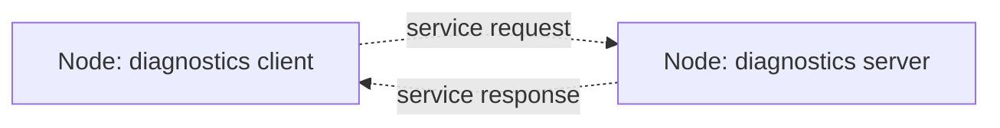

# Lesson 5 Services

## Source Section

- Source: `# Phase 5: Services`
- Roadmap summary: Teach request/response communication, create a Python service server, create minimal and class-based service clients, and inspect services from the ROS 2 CLI.

## Lesson Purpose

This lesson teaches the learner how a ROS 2 node can ask another node for a one-time answer.

Lesson 4 focused on **topics**, which are best for repeated data streams such as fake IMU tilt readings. Lesson 5 introduces **services**, which are better for direct request/response interactions such as asking a diagnostics node to run a check and return a result.

The learner should finish this lesson understanding that services are not a replacement for topics. A service is for a specific question and answer. A topic is for ongoing data.

## Learning Objectives

- Explain what a ROS 2 service is in beginner-friendly language.
- Compare topics and services without treating one as better than the other.
- Identify the service server, service client, request, and response in a small rover example.
- Create a Python service server named `diagnostics_server`.
- Create a minimal Python service client named `diagnostics_client_minimal`.
- Create a reusable class-based service client named `diagnostics_client`.
- Use `ros2 service list` to find running services.
- Use `ros2 service type` to inspect a service's type.
- Use `ros2 service call` to test a service without writing client code.
- Explain the result of a small diagnostics request system in one or two minutes.

## Prerequisite Knowledge

- The learner completed Lesson 1 and has a working `~/ros2_ws` workspace.
- The learner completed Lesson 2 and understands a basic Python ROS 2 node.
- The learner completed Lesson 3 and can inspect running nodes from the CLI.
- The learner completed Lesson 4 and understands publisher, subscriber, topic, and message at a beginner level.
- The learner can source ROS 2 Jazzy with `source /opt/ros/jazzy/setup.bash`.
- The learner can source the local workspace with `source ~/ros2_ws/install/setup.bash`.
- The learner knows that each terminal must be sourced separately.
- The learner does not need to understand custom interfaces, parameters, launch files, actions, Navigation2, Gazebo, or robot simulation yet.

## Required Tools

- Ubuntu 24.04 LTS.
- ROS 2 Jazzy base installation.
- `~/ros2_ws` workspace.
- Existing `rover_core` Python package from earlier lessons.
- Terminal.
- Text editor such as `nano`, VS Code, or another beginner-friendly editor.
- Optional `rqt_graph` from Lesson 3 for a visual check.

This lesson is low-storage friendly. It uses ROS 2 base tools, Python nodes, and built-in service interfaces. It should not require Gazebo, RViz-heavy workflows, Navigation2, MoveIt, Docker, YOLO, AI packages, large simulation worlds, or the full ROS desktop stack.

> **Teacher note**
>
> Keep the first service example intentionally small. The goal is to understand the communication pattern before designing custom rover-specific service interfaces.

## Estimated Time

60 to 90 minutes for a beginner.

Allow extra time if the learner is still getting comfortable with multiple terminals, package entry points, and rebuilding a Python package.

## Concepts to Teach

- **Service:** A named ROS 2 communication endpoint for one request and one response.
- **Request:** The question or command sent by the client to the service server.
- **Response:** The answer sent back by the service server.
- **Service server:** The node that offers the service and answers requests.
- **Service client:** The node or CLI command that calls the service.
- **Service type:** The interface that defines the request fields and response fields.
- **Built-in service interface:** A service type already provided by ROS 2 packages, used before creating custom interfaces.
- **Waiting for a service:** The client checks that the server exists before sending a request.
- **Future object:** The object returned while the client waits for the service response in Python.
- **CLI service call:** Testing a service directly from the terminal without writing a client node.

### Mental Models to Build

- **A service is like asking a specific question:** The client asks, the server answers, and the interaction is finished.
- **A topic is like a radio station; a service is like a help desk:** A topic keeps broadcasting new messages. A service waits for a request and sends back one answer.
- **The server must be running first:** If no node offers the service, the client has nobody to ask.
- **A service type is the question-and-answer form:** It defines what the request can contain and what the response can contain.
- **The CLI can act like a temporary client:** `ros2 service call` lets the learner test a service before writing a client node.

### Suggested Dann ROS 2 Graph

Use this small Dann ROS 2 Graph to show the service relationship.



In the actual lesson, explain:

- This is a **Dann ROS 2 Graph**, a course drawing convention and not an official ROS 2 standard name.
- Rectangles are ROS 2 nodes.
- The dotted arrows show a service request and service response.
- The request arrow means the client asks the server for diagnostics.
- The response arrow means the server sends back one answer.
- This is different from the topic diagrams in Lesson 4 because there is no continuous topic circle between the nodes.

## Commands to Demonstrate

```bash
source /opt/ros/jazzy/setup.bash
```

Sets up ROS 2 Jazzy in the current terminal. This matters because the `ros2` command and Python ROS 2 imports depend on the terminal environment.

```bash
source ~/ros2_ws/install/setup.bash
```

Makes the learner's local workspace visible in the current terminal. This matters because `rover_core` lives in the learner's workspace.

```bash
cd ~/ros2_ws
```

Moves the terminal to the learner's ROS 2 workspace before building or checking package files.

```bash
ros2 interface show example_interfaces/srv/Trigger
```

Shows the built-in `Trigger` service interface. This proves that a service type has a request section and a response section.

```bash
colcon build --packages-select rover_core
```

Builds only the beginner package instead of rebuilding everything. This keeps the workflow lightweight and focused.

```bash
source install/setup.bash
```

Refreshes the current terminal after rebuilding so ROS 2 can find the updated console scripts.

```bash
ros2 run rover_core diagnostics_server
```

Runs the service server. Expected success sign: the node logs that the diagnostics service is ready.

```bash
ros2 node list
```

Lists running nodes. Expected success sign: `/diagnostics_server` appears while the service server is running.

```bash
ros2 service list
```

Lists visible services. Expected success sign: `/run_diagnostics` appears.

```bash
ros2 service type /run_diagnostics
```

Shows the service type used by `/run_diagnostics`. Expected success sign: `example_interfaces/srv/Trigger`.

```bash
ros2 service call /run_diagnostics example_interfaces/srv/Trigger "{}"
```

Calls the diagnostics service from the terminal. Expected success sign: the response shows `success=True` and a message such as `Battery OK, motors OK, IMU OK`.

```bash
ros2 run rover_core diagnostics_client_minimal
```

Runs the minimal client node. Expected success sign: it waits for `/run_diagnostics`, sends a request, prints the response, and exits.

```bash
ros2 run rover_core diagnostics_client
```

Runs the class-based client node. Expected success sign: it calls the same service with cleaner reusable structure and prints the same kind of response.

```bash
rqt_graph
```

Optionally opens a visual graph. Expected success sign: the diagnostics client and server may be visible while both are running, but quick client nodes may disappear quickly after they finish.

> **Teacher note**
>
> Prepare students for short-lived client nodes. If the client exits quickly, it may be hard to catch in `rqt_graph`. That is not failure. The CLI service checks are the primary verification for this lesson.

## Code Artifacts to Create

- `rover_core/diagnostics_server.py`: A Python node that offers `/run_diagnostics` using `example_interfaces/srv/Trigger`.
- `rover_core/diagnostics_client_minimal.py`: A small procedural client that waits for `/run_diagnostics`, sends a request, prints the response, and exits.
- `rover_core/diagnostics_client.py`: A class-based client that demonstrates a cleaner reusable client pattern.
- `setup.py`: Add console script entry points for the three new nodes.

Recommended service names and node names:

| Artifact | ROS 2 name | Purpose |
|---|---|---|
| `diagnostics_server.py` | `diagnostics_server` | Answers one-time diagnostics requests |
| `diagnostics_client_minimal.py` | `diagnostics_client_minimal` | Shows the simplest client flow |
| `diagnostics_client.py` | `diagnostics_client` | Shows a reusable class-based client |
| Service endpoint | `/run_diagnostics` | The named service clients call |

> **Future topic**
>
> Students may ask why the request is empty and why the response only has `success` and `message`. This is a good question, but students do not need to master custom service design yet. It will be taught in Phase 6: Custom Interfaces, especially Section 6.6: Custom Service. For now, the short version is: `Trigger` is a built-in service type that is perfect for a simple "please run this now" request.

## Learner Activities

- Inspect the built-in `Trigger` interface before writing code.
- Create the diagnostics service server.
- Register the server in `setup.py`.
- Build the package and source the workspace.
- Run the server in one terminal.
- Inspect the running service from another terminal.
- Call the service from the CLI.
- Create and run the minimal client.
- Create and run the class-based client.
- Compare a service call with the topic flow from Lesson 4.
- Explain aloud which node asked the question and which node answered.

## Simple Exercise or Mini-Project

**Mini-project name:** Diagnostics Ask-And-Answer

**Task:** Build a small rover diagnostics service system.

Required parts:

- A service server named `diagnostics_server`.
- A service named `/run_diagnostics`.
- A response that includes a clear success result.
- A response message that mentions at least three rover checks, such as battery, motors, and IMU.
- One CLI service call.
- One Python client call.

**Success criteria:**

- `ros2 node list` shows `/diagnostics_server` while the server is running.
- `ros2 service list` shows `/run_diagnostics`.
- `ros2 service type /run_diagnostics` prints `example_interfaces/srv/Trigger`.
- `ros2 service call /run_diagnostics example_interfaces/srv/Trigger "{}"` returns a successful response.
- `ros2 run rover_core diagnostics_client_minimal` prints the diagnostics response.
- The learner can explain why this is a service instead of a topic.

**Hint:** Start the server before running the client. If the client cannot find the service, check whether the server terminal is still running and sourced correctly.

**What the learner should decide on their own:** The learner should decide the exact diagnostic message text and which three rover checks to include.

**One-minute explanation prompt:** Ask the learner to explain:

- what the client requested;
- what the server returned;
- how the CLI proved the service existed;
- why `/run_diagnostics` is a good service example and not a good topic example.

## Verification Checks

- `ros2 interface show example_interfaces/srv/Trigger`: Shows that the service has an empty request section and response fields.
- `ros2 node list`: Shows `/diagnostics_server` while the server is running.
- `ros2 service list`: Shows `/run_diagnostics`.
- `ros2 service type /run_diagnostics`: Shows `example_interfaces/srv/Trigger`.
- `ros2 service call /run_diagnostics example_interfaces/srv/Trigger "{}"`: Returns a successful diagnostics response.
- `ros2 run rover_core diagnostics_client_minimal`: Prints the diagnostics result from Python.
- `ros2 run rover_core diagnostics_client`: Prints the diagnostics result from the class-based client.
- Observable result: stopping the server with `Ctrl+C` makes `/run_diagnostics` disappear from `ros2 service list`.

**Success sign:** The learner can start a service server, prove the service exists, call it from the terminal, call it from Python, and explain the request/response direction.

## Beginner Mistakes to Watch For

- Thinking a service is the same thing as a topic with a different command.
- Expecting a service to publish repeated updates forever.
- Running the client before the server is running.
- Forgetting to source ROS 2 in a new terminal.
- Forgetting to source `~/ros2_ws/install/setup.bash` after building.
- Editing Python files but forgetting to add console script entry points in `setup.py`.
- Rebuilding from the wrong directory.
- Calling the wrong service name, such as `run_diagnostics` instead of `/run_diagnostics`.
- Typing the service type incorrectly.
- Forgetting the empty YAML request string `"{}"` in `ros2 service call`.
- Confusing the node name `diagnostics_server` with the service name `/run_diagnostics`.
- Expecting `rqt_graph` to show a completed client after it has already exited.
- Assuming blank output from `source` means the command failed.

## Troubleshooting Topics

| Symptom | Likely cause | Fix | Verification |
|---|---|---|---|
| `ros2: command not found` | ROS 2 was not sourced in this terminal | Run `source /opt/ros/jazzy/setup.bash` | `ros2 --help` prints help text |
| `Package 'rover_core' not found` | Workspace was not built or sourced | Run `cd ~/ros2_ws`, `colcon build --packages-select rover_core`, then `source install/setup.bash` | `ros2 pkg list | grep rover_core` prints `rover_core` |
| `No executable found` | Console script entry point is missing or package was not rebuilt | Check `setup.py`, rebuild, and source `install/setup.bash` | `ros2 run rover_core diagnostics_server` starts the server |
| `/run_diagnostics` does not appear | Server is not running, crashed, or was started in an unsourced terminal | Restart the server after sourcing ROS 2 and the workspace | `ros2 service list` shows `/run_diagnostics` |
| `ros2 service call` complains about the type | Service type was mistyped | Run `ros2 service type /run_diagnostics` and copy the exact type | The call uses `example_interfaces/srv/Trigger` |
| Client waits forever | The service server is not running or the service name does not match | Start the server and confirm the service name | Client prints `service not available, waiting again` only until server starts |
| Client prints import errors | Python file has a typo or dependency import is missing | Check imports and rebuild the package | `ros2 run rover_core diagnostics_client_minimal` starts without import errors |
| `rqt_graph` does not show the client | The client finished too quickly | Use CLI verification as the main check, or temporarily keep the client alive in a teacher demo | `ros2 service call` and client output prove the service works |

## Checkpoint Questions

- What is the difference between a topic and a service?
- In the diagnostics example, which node is the service server?
- In the diagnostics example, which node or command is the service client?
- What does `/run_diagnostics` name: a node, a topic, or a service?
- Why does the client need to wait for the service before sending a request?
- What does `example_interfaces/srv/Trigger` define?
- Why is `ros2 service call` useful before writing a Python client?
- What should disappear from `ros2 service list` when the server stops?

## Teacher Notes

Teach services as a new communication pattern, not as a more advanced version of topics.

**Likely learner question:** "Why not use a topic for diagnostics?"

Use a gentle answer: a topic is better when data keeps arriving over time. A service is better when one node asks for one answer, such as "run diagnostics now." If diagnostics became a repeated health stream later, that repeated status could become a topic.

**Likely learner question:** "Why is the request empty?"

Use a future-topic bridge: this is a good question, but students do not need to master custom service design yet. It will be taught in Phase 6: Custom Interfaces. For now, the short version is that `Trigger` means "please do the action now," so the request does not need extra fields.

**Likely learner misunderstanding:** The learner may think `/run_diagnostics` is a node.

Add a student-facing note in the actual lesson:

> **Student note**
>
> `diagnostics_server` is the node. `/run_diagnostics` is the service offered by that node. A node can offer services, publish topics, subscribe to topics, or do several of these at once.

**Likely learner misunderstanding:** The learner may think services stay visible after the server stops.

Use the CLI to make this visible. Run `ros2 service list` while the server is running, stop the server with `Ctrl+C`, then run `ros2 service list` again.

**Likely learner misunderstanding:** The learner may expect the Python client to keep running.

Explain that many service clients are short-lived tools. They ask one question, receive one answer, print the result, and exit.

**Wrong-but-reasonable interpretation:** "Services are for important data and topics are for less important data."

Correct gently: importance is not the difference. The communication shape is the difference. Use topics for ongoing streams. Use services for request/response work.

**Where to add callouts in the actual lesson:**

- After introducing service vocabulary, add a "what it is and what it is not" note.
- After showing `Trigger`, explain the request and response separator in the interface output.
- After `ros2 service list`, remind the learner that the server must be running.
- After `ros2 service call`, explain the empty YAML request `"{}"`.
- After the client exits, reassure the learner that exiting is normal for a one-shot client.

**Pacing reminder:** Do not introduce custom `.srv` files in the main body of this lesson. Mention them only as future work for Phase 6. Keep the learner focused on the service communication pattern first.

**Mermaid verification notes:** The diagram uses `flowchart LR`, simple ASCII node IDs, quoted labels, and common dotted arrows. It should preview safely in GitHub and VS Code.
