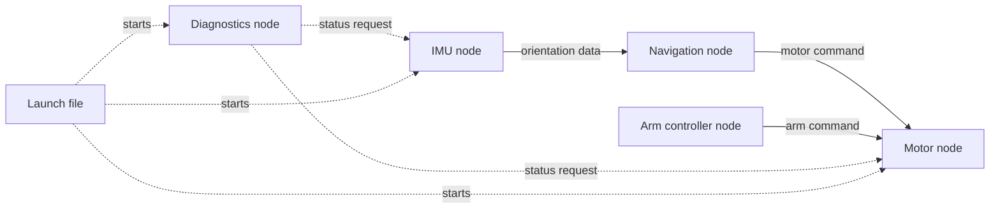

# Lesson 0 Orientation

## Lesson Goal

By the end of this lesson, you will be able to explain what ROS 2 is, why robot software is often split into small programs, and how your future rover software can be drawn as a simple communication graph.

You will not install ROS 2 or write code yet. This lesson is about getting oriented before the commands begin.

## Why This Matters

ROS 2 can feel confusing at first because it introduces many new words: node, topic, service, parameter, launch file, workspace, package, and more.

Before learning those one by one, it helps to understand the main idea:

A robot is usually not one giant program. A robot is usually a team of smaller programs that share information.

For your agricultural rover, one program might read an IMU sensor, another might command motors, another might answer diagnostic questions, and another might start everything together. ROS 2 gives these programs a common way to find each other and communicate.

## Before You Start

You only need:

- A notebook, paper, whiteboard, or drawing app.
- A pen or pencil.
- Basic comfort with the idea that sensors produce data and motors receive commands.
- No prior ROS 2 experience.
- No ROS 2 installation yet.

Storage note: this lesson is very low-storage friendly. You do not need Gazebo, RViz, Navigation2, MoveIt, Docker, YOLO, AI packages, simulation worlds, or a full desktop robotics stack.

## New Words

ROS 2: A robotics software framework. It helps robot programs communicate, organize behavior, and be inspected while they run.

Node: One small ROS 2 program with a focused job. For example, an IMU node might read orientation data.

Topic: A named stream of messages. Topics are useful for data that keeps flowing, such as sensor readings.

Publisher: A node that sends messages on a topic.

Subscriber: A node that receives messages from a topic.

Service: A request-and-response connection. One node asks for something, and another node replies.

Parameter: A setting that can tune a node's behavior, such as a speed limit or update rate.

Launch file: A file that starts several ROS 2 programs together.

Distributed robotics software: Robot software made from multiple cooperating programs. Those programs may run in different processes, and later they may even run on different computers.

You do not need to master all of these words today. For now, focus on the simple idea: ROS 2 helps small robot programs communicate.

## Big Idea

Imagine your rover as a team.

The IMU node watches orientation. The motor node listens for movement commands. The diagnostics node answers questions like "Are you healthy?" The navigation node may later decide where the rover should go.

Each node has one job. ROS 2 helps the nodes pass messages instead of forcing everything into one large file.

Here is a simple teaching sketch:



This diagram is not the final rover design. It is a beginner map. You will build the real understanding piece by piece in later lessons.

## Step 1: Start With The Rover Jobs

Before thinking about ROS 2 commands, list what the rover needs to do.

Example rover jobs:

- Read orientation from an IMU.
- Send commands to motors.
- Control an arm.
- Report diagnostics.
- Later, decide where to navigate.
- Later, process camera or vision data.

The key question is:

Which job should be handled by which small program?

A first draft could look like this:

- `imu_node`: reads orientation data.
- `motor_node`: receives motor commands.
- `arm_controller_node`: decides arm movement.
- `diagnostics_node`: answers health checks.
- `navigation_node`: later decides movement goals.

No terminal command is needed for this step.

## Step 2: Decide Who Sends Information

Now think about which programs produce information.

The `imu_node` produces orientation data. That makes it a publisher.

The `navigation_node` may need orientation data to make decisions. That makes it a subscriber to the IMU data.

In plain English:

The IMU node publishes orientation data, and the navigation node subscribes to it.

You do not need to know the exact message type yet. That comes later. For now, just understand the direction of information.

## Step 3: Decide Who Receives Commands

Some nodes mostly listen for instructions.

For example, the `motor_node` might listen for motor commands.

The navigation node might eventually publish a command like "move forward slowly." The motor node subscribes to that command and turns it into motor behavior.

This is why splitting software into nodes helps. The navigation logic does not need to directly contain all the motor code. It can send a message, and the motor node can handle the motor-specific work.

## Step 4: Add One Request-And-Response Example

Not every connection is a constant stream.

Sometimes one node asks a question and another node answers.

Example:

The diagnostics node asks the motor node, "Are you healthy?"

The motor node replies, "Yes, motor control is running."

That kind of ask-and-answer pattern is called a service in ROS 2.

You do not need to build a service yet. Just remember:

- Topics are good for ongoing streams of messages.
- Services are good for one request and one response.

## Step 5: Add Parameters And Launch Files

A parameter is a setting.

For example:

- `max_speed`
- `diagnostic_rate`
- `arm_speed_limit`

Parameters matter because robot behavior often needs tuning. You may want the rover to move slowly while testing and faster later.

A launch file starts multiple pieces together.

For example, instead of manually starting the IMU node, motor node, and diagnostics node one by one, a launch file can start them as a group.

That's a good question if you are wondering how launch files work. We will study launch files properly later, so you do not need to master them yet. For now, the short version is: a launch file is a convenient way to start several ROS 2 programs together.

## Step 6: Preview Future ROS 2 Checks

You do not need to run these commands in this lesson. They are shown so you can recognize how ROS 2 will let you inspect your robot later.

```bash
ros2 node list
```

This will list running ROS 2 nodes.

```bash
ros2 topic list
```

This will list active topics.

```bash
ros2 service list
```

This will list available services.

```bash
ros2 param list
```

This will list visible parameters.

If these commands do not work on your computer yet, that is expected. ROS 2 installation starts in the next phase.

## Minimal Code

There is no code in this lesson.

That is intentional. Before writing ROS 2 programs, you are building the mental model that will make the code easier to understand later.

## Run It

There is nothing to run yet.

Instead, create a drawing called `rover_software_graph`.

You can draw it on paper, in a notebook, on a whiteboard, or in any simple drawing app.

## Verify It

Use this checklist to verify your drawing:

- It has at least five nodes.
- At least one node represents a sensor.
- At least one node represents a motor or controller.
- At least two arrows show information moving from one node to another.
- At least one connection is labeled as a topic or message stream.
- At least one connection is labeled as a service or request-and-response.
- At least two possible parameters are written somewhere near the graph.
- There is a note that launch files will later start multiple nodes together.

Expected success signs:

- You can point to one node and explain its job.
- You can point to one arrow and explain what might travel along it.
- You can explain why the rover is easier to understand as a team of small programs.

## Common Mistakes

- Thinking ROS 2 is the robot. ROS 2 is not the physical robot. It is software infrastructure that helps robot programs communicate.
- Trying to understand every ROS 2 word immediately. You do not need to master all the vocabulary today.
- Drawing one giant program called `rover`. Try splitting it by jobs: sensing, motor control, diagnostics, tuning, and startup.
- Confusing topics and services. For now, remember that topics are ongoing streams, while services are ask-and-answer interactions.
- Wanting to install heavy tools right away. Tools like Gazebo, Navigation2, MoveIt, Docker, and AI vision are future work. First, you are learning the communication model.

## Troubleshooting

| Symptom | Likely cause | Fix | How to verify |
|---|---|---|---|
| You cannot explain what ROS 2 does | The idea still feels abstract | Say it this way: ROS 2 helps small robot programs exchange messages | You can describe ROS 2 without using a memorized definition |
| Your drawing has only one big program | You are thinking like a single Python script | Split the rover by jobs, such as IMU, motor, arm, diagnostics, and navigation | Your drawing has several named nodes |
| Topics and services feel the same | Both are communication patterns | Use timing: topics keep flowing, services ask once and answer once | You can label one stream and one request-response connection |
| You want to start with simulation | Simulation feels more visual | Keep simulation as future work and focus on the software graph first | You can explain why no heavy tool is needed for Lesson 0 |
| The diagram feels imperfect | You are treating it like final architecture | Treat it as a learning sketch | You can revise it without feeling like you failed |

## Simple Exercise or Mini-Project

Create your own `rover_software_graph`.

Task:

Draw a future rover software graph with at least five nodes.

Requirements:

- Include `imu_node`.
- Include `motor_node`.
- Include `diagnostics_node`.
- Include at least two other rover nodes.
- Draw arrows showing how information moves.
- Label at least one arrow as a topic.
- Label at least one connection as a service.
- Add two possible parameters, such as `max_speed` and `diagnostic_rate`.

Success criteria:

- Someone else can look at your drawing and understand which node senses, which node controls, and which node checks health.
- You can explain the drawing in under two minutes.

Optional hint:

Start with the physical rover jobs first. Then turn each job into a possible ROS 2 node.

## Recap

- ROS 2 helps robot programs communicate.
- A node is one small program with a focused job.
- Topics are useful for ongoing message streams.
- Services are useful for request-and-response interactions.
- Parameters tune behavior.
- Launch files will later help start multiple nodes together.
- Heavy tools are postponed so you can learn ROS 2 fundamentals clearly first.

## Checkpoint Questions

- What problem does ROS 2 help solve in robot software?
- Why should the rover not start as one giant program?
- What is one possible sensor node for the rover?
- What is one possible controller node for the rover?
- What is the difference between a topic and a service?
- What is one parameter that might be useful for a rover?
- Why are tools like Gazebo, Navigation2, MoveIt, Docker, and AI vision saved for later?
