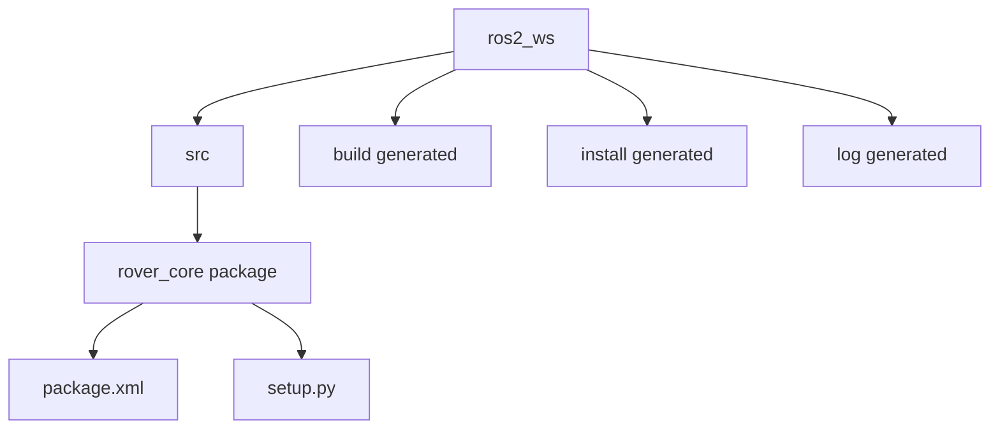

# Lesson 1 Installation, Workspace, and Package Mechanics

## Lesson Goal

By the end of this lesson, you will be able to verify your ROS 2 environment, create a clean ROS 2 learning workspace named `ros2_ws`, create your first Python package named `rover_core`, build it, source it, and prove that ROS 2 can find it.

> **Important**
>
> This lesson assumes you already completed the installation guide: [ROS 2 Jazzy Base Install and Verification](../../Installation-Guides/01%20ROS%202%20Jazzy%20Base%20Install%20and%20Verification.md). If ROS 2 is not installed yet, pause here and do that guide first.

## Why This Matters

ROS 2 projects are not usually built as random Python files scattered around your computer.

They are organized into:

- a **workspace**, which is the main project folder;
- a `src/` folder, where your source packages live;
- one or more **packages**, which hold related ROS 2 code;
- generated folders like `build/`, `install/`, and `log/`, which are created when you build.

In this course, we are learning ROS 2 first. The future agricultural rover gives us a direction, but we are not jumping into thesis implementation yet. That is why the workspace is called:

```bash
ros2_ws
```

It means: "This is my ROS 2 learning workspace."

Later, when the fundamentals are comfortable, the same skills will help you build the rover software stack with much less confusion.

## Before You Start

You need:

- Ubuntu 24.04 LTS.
- ROS 2 Jazzy base installed.
- `colcon` installed from the installation guide.
- A terminal inside Ubuntu.
- Basic comfort with `cd`, `mkdir`, and reading command output.
- A text editor if you want to inspect generated files.
- Git, if you are syncing course files or code between macOS and Ubuntu.

This lesson is low-storage friendly. You do not need Gazebo, Navigation2, MoveIt, Docker, YOLO, AI packages, large simulation worlds, or the full ROS desktop stack.

### If You Use macOS Plus an Ubuntu VM

If you edit this course on macOS using Codex or Claude and run ROS 2 inside an Ubuntu VM, that is okay.

The better workflow is:

1. Edit on macOS using Codex or Claude.
2. Save your work with Git by committing, stashing, or pushing.
3. In Ubuntu, use Git to pull, fetch, or switch to the same work.
4. Run ROS 2 commands and tests inside Ubuntu.

The companion workspace repo is:

[Danncode10/ros2_ws](https://github.com/Danncode10/ros2_ws)

The shared folder, such as a Spice client folder, is still useful for quick file transfer, screenshots, and reading notes. But do not make it the main place where you build ROS 2 workspaces.

For beginner ROS 2 practice, keep the actual ROS 2 workspace inside Ubuntu:

```bash
~/ros2_ws
```

Why? Shared folders can sometimes have slower file access, permission differences, symlink behavior, or paths with spaces. Those details can make beginner ROS 2 troubleshooting harder than it needs to be.

Install Git in Ubuntu if needed:

```bash
sudo apt update
sudo apt install git
```

Use this workflow:

| Work | Recommended place |
|---|---|
| Edit course notes or examples | macOS project folder |
| Move code between macOS and Ubuntu | Git commit, stash, push, pull, or fetch |
| Quick screenshots or one-off file transfer | Spice or VM shared folder |
| Run ROS 2 commands | Ubuntu terminal |
| Build beginner ROS 2 packages | `~/ros2_ws` inside Ubuntu |

> **Student note**
>
> The shared folder is useful, but Git is safer for real code syncing. The ROS 2 practice workspace should still be a simple folder in Ubuntu's home directory.

## New Words

**ROS 2 distribution:** A named ROS 2 release. This course uses **Jazzy** because it matches Ubuntu 24.04 LTS.

**Environment:** The set of terminal settings that tell your shell where commands and packages are located. If the environment is not set up, the terminal may not know what `ros2` means.

**Source:** To run a setup file in the current terminal. In ROS 2, sourcing gives the terminal directions to ROS 2 or to your workspace.

**Workspace:** A folder where ROS 2 packages are built together. In this lesson, the workspace is `~/ros2_ws`.

**Package:** A unit of ROS 2 code and metadata. A package is not the same as a node. A package is more like a container where future nodes can live.

**`src/` folder:** The folder inside a workspace where source packages go.

**`colcon`:** The build tool commonly used for ROS 2 workspaces.

**Build:** To process the packages in the workspace so ROS 2 can use them.

**`build/`, `install/`, and `log/`:** Folders generated by `colcon build`.

- `build/` stores temporary build files.
- `install/` stores the built workspace files that ROS 2 can use.
- `log/` stores build logs.

**`package.xml`:** A package metadata file. It describes the package and its dependencies.

**`setup.py`:** A Python packaging file used by Python ROS 2 packages.

**Dependency:** Something your package needs. In this lesson, `rover_core` depends on `rclpy`, the Python library used to write ROS 2 nodes.

> **Beginner reminder**
>
> A workspace is not the ROS 2 installation. ROS 2 itself is installed under `/opt/ros/jazzy`. Your own learning workspace will live at `~/ros2_ws`.

## Big Idea

Think of the workspace like a practice garage.

The garage is `ros2_ws`.

Inside it, the `src/` folder is where you place robot software packages.

When you run `colcon build`, ROS 2 prepares those packages and creates generated folders. After that, you source the workspace so your terminal can find the packages you just built.

Here is the folder layout you will create:



**How to read this:** `ros2_ws` is the workspace root. You create packages inside `src/`. The `build/`, `install/`, and `log/` folders are created by `colcon build`.

> **Student note**
>
> This is a folder diagram, not a ROS 2 node graph. There are no running nodes yet. Nodes begin in Phase 2.

## Step 1: Open an Ubuntu Terminal

Open a terminal inside Ubuntu.

If you are using a Mac plus an Ubuntu VM, make sure this terminal is in Ubuntu, not macOS.

Check where you are:

```bash
pwd
```

You will likely see something like:

```text
/home/your_username
```

That is a good place to begin.

## Step 2: Source ROS 2 Jazzy

Run:

```bash
source /opt/ros/jazzy/setup.bash
```

This command tells the current terminal where the system ROS 2 Jazzy installation is.

If it works, it usually prints nothing.

> **Student note**
>
> Blank output is normal for many `source` commands. No news is often good news.

Now check that the `ros2` command exists:

```bash
ros2 --help
```

Expected success sign:

- You see help text with ROS 2 command options.
- You do not see `ros2: command not found`.

If `ros2` is not found, go back to the installation guide before continuing.

## Step 3: Check That ROS 2 Can See Packages

Run:

```bash
ros2 pkg list
```

This lists ROS 2 packages that your terminal can currently see.

You should see many package names. The exact list may be long.

Example names might include:

```text
ament_cmake
demo_nodes_cpp
rclpy
ros2cli
```

You do not need to understand every package name yet.

**Success sign:** the command prints package names instead of an error.

## Step 4: Create Your Workspace Folder

Create the workspace and the `src/` folder:

```bash
mkdir -p ~/ros2_ws/src
```

What this does:

- `mkdir` creates folders.
- `-p` means "also create parent folders if needed, and do not complain if they already exist."
- `~/ros2_ws` is your ROS 2 learning workspace.
- `src` is where your source packages will go.

Now move into the workspace root:

```bash
cd ~/ros2_ws
```

Check the folder:

```bash
pwd
```

Expected output should end with:

```text
/ros2_ws
```

Now list the contents:

```bash
ls
```

Expected output:

```text
src
```

At this moment, the workspace has only one folder: `src`.

## Step 5: Build the Empty Workspace

Run this from the workspace root:

```bash
colcon build
```

This builds the workspace.

Because the workspace is still empty, there are no real packages to build yet. That is okay. This step proves that `colcon` works and that you are building from the correct place.

Expected success signs:

- The command finishes without an error.
- New folders appear in `~/ros2_ws`.

Check:

```bash
ls
```

You should now see:

```text
build  install  log  src
```

> **Student note**
>
> Do not manually edit files inside `build/`, `install/`, or `log/`. Your source work belongs in `src/`.

## Step 6: Source Your Local Workspace

Run:

```bash
source install/setup.bash
```

This tells the current terminal about packages built in this workspace.

Right now, the workspace does not contain your own package yet, but this command is still important. You will use it constantly in ROS 2 development.

Expected success sign:

- The command prints nothing.
- There is no error.

> **Beginner reminder**
>
> You usually source two things in this order:
>
> 1. `/opt/ros/jazzy/setup.bash` for the system ROS 2 installation.
> 2. `~/ros2_ws/install/setup.bash` for your local workspace after building.

## Step 7: Create Your First Python Package

Move into the workspace source folder:

```bash
cd ~/ros2_ws/src
```

Now create a Python ROS 2 package:

```bash
ros2 pkg create --build-type ament_python --dependencies rclpy rover_core
```

What this means:

- `ros2 pkg create` creates a new ROS 2 package.
- `--build-type ament_python` makes it a Python package.
- `--dependencies rclpy` says this package will use `rclpy`.
- `rover_core` is the package name.

Why `rover_core`?

We are still learning ROS 2 first, but the course has a future rover direction. This package gives us a practical place for future beginner nodes, such as a heartbeat node, fake IMU node, motor monitor node, and diagnostics node.

> **Future topic**
>
> That's a good question if you are wondering what a node is. We will study nodes properly in Phase 2, so you do not need to master them yet. For now, the short version is: a node is a running ROS 2 program, and a package is a container where node code can live.

Check that the package folder exists:

```bash
ls
```

Expected output includes:

```text
rover_core
```

Inspect the package:

```bash
ls rover_core
```

You should see files and folders similar to:

```text
package.xml  resource  rover_core  setup.cfg  setup.py  test
```

Do not worry if the exact order is different.

## Step 8: Look at the Important Package Files

Move into the package:

```bash
cd ~/ros2_ws/src/rover_core
```

List the files:

```bash
ls
```

Two important files are:

- `package.xml`
- `setup.py`

Preview `package.xml`:

```bash
sed -n '1,120p' package.xml
```

You should see package metadata and a dependency on `rclpy`.

Preview `setup.py`:

```bash
sed -n '1,160p' setup.py
```

You should see Python package setup information.

> **Student note**
>
> You do not need to edit these files yet. For now, just learn that ROS 2 packages have structure. Later, when we add executable nodes, `setup.py` will become more important.

## Step 9: Rebuild the Workspace

Move back to the workspace root:

```bash
cd ~/ros2_ws
```

Build again:

```bash
colcon build
```

This time, the workspace contains `rover_core`, so `colcon` has a package to build.

Expected success signs:

- The build finishes without errors.
- The output mentions `rover_core` or says the package finished.

After building, source the workspace again:

```bash
source install/setup.bash
```

This step matters. Building prepares the package, but sourcing tells the current terminal about the newly built package.

## Minimal Code

No custom code is required in this lesson.

The generated package contains starter files, but you are not writing a ROS 2 node yet. That is intentional. This lesson is about workspace and package mechanics.

> **Future topic**
>
> That's a good question if you want to write Python code immediately. We will write the first beginner ROS 2 Python node in Phase 2. In this lesson, focus on creating a workspace, creating a package, building it, and proving ROS 2 can find it.

## Run It

There is no custom node to run yet.

The "run" part of this lesson is the build-and-source workflow:

```bash
cd ~/ros2_ws
colcon build
source install/setup.bash
```

Expected success signs:

- `colcon build` completes without errors.
- `source install/setup.bash` prints nothing and returns to the prompt.
- Your terminal is now aware of the local workspace.

## Verify It

First, check that ROS 2 can see your package:

```bash
ros2 pkg list | grep rover_core
```

Expected output:

```text
rover_core
```

Now check where ROS 2 finds it:

```bash
ros2 pkg prefix rover_core
```

Expected output should point somewhere inside:

```text
/home/your_username/ros2_ws/install/rover_core
```

This is the main proof that your package is built, sourced, and visible to ROS 2.

You can also check the workspace folders:

```bash
ls ~/ros2_ws
```

Expected output:

```text
build  install  log  src
```

And check the package source:

```bash
ls ~/ros2_ws/src/rover_core
```

Expected output includes:

```text
package.xml  setup.py
```

## Common Mistakes

- **Forgetting to source ROS 2:** If `ros2` is not found, run `source /opt/ros/jazzy/setup.bash`.
- **Building from the wrong folder:** Run `colcon build` from `~/ros2_ws`, not from `~/ros2_ws/src`.
- **Creating the package in the wrong place:** `rover_core` should be inside `~/ros2_ws/src`.
- **Forgetting to source after building:** After `colcon build`, run `source install/setup.bash`.
- **Expecting `source` to print a success message:** Blank output is normal.
- **Editing generated folders:** Do not edit `build/`, `install/`, or `log/` manually.
- **Thinking a package is a node:** A package is a container. A node is a running ROS 2 program. Nodes come next.
- **Building inside the shared course folder:** Keep beginner ROS 2 practice in `~/ros2_ws` inside Ubuntu.

## Troubleshooting

| Symptom | Likely cause | Fix | How to verify |
|---|---|---|---|
| `ros2: command not found` | ROS 2 was not sourced, or installation is incomplete | Run `source /opt/ros/jazzy/setup.bash`; if that file does not exist, complete the installation guide | `ros2 --help` shows help text |
| `colcon: command not found` | `colcon` is not installed | Return to the installation guide and install the listed build tools | `colcon --help` shows help text |
| `colcon build` creates only generated folders but no package builds | The workspace is empty | This is normal before creating `rover_core`; continue to the package creation step | `ls ~/ros2_ws/src` shows whether a package exists |
| `colcon build` cannot find `rover_core` | The package was created in the wrong folder | Make sure `rover_core` is under `~/ros2_ws/src` | `find ~/ros2_ws/src -maxdepth 2 -name package.xml` finds the package |
| `ros2 pkg list | grep rover_core` prints nothing | The workspace was built but not sourced | Run `cd ~/ros2_ws` and `source install/setup.bash` | `ros2 pkg prefix rover_core` prints an install path |
| `source install/setup.bash` says file not found | You are in the wrong folder, or the workspace has not been built | Run `cd ~/ros2_ws`, then `colcon build`, then `source install/setup.bash` | `ls ~/ros2_ws/install/setup.bash` shows the setup file |
| The terminal works once, then fails in a new terminal | New terminals do not automatically inherit old terminal setup | Source ROS 2 and the workspace again in the new terminal | `ros2 pkg list | grep rover_core` prints `rover_core` |
| Building in the shared folder causes odd errors | VM shared folder behavior may affect permissions, symlinks, or paths | Use `~/ros2_ws` inside Ubuntu for the practice workspace | `colcon build` succeeds from `~/ros2_ws` |

## Simple Exercise or Mini-Project

Create a **First Rover Workspace Check**.

**Task:**

Prove that your ROS 2 learning workspace is correctly created, built, sourced, and visible to ROS 2.

**Requirements:**

- Create `~/ros2_ws`.
- Create `~/ros2_ws/src`.
- Create the package `rover_core`.
- Build from the workspace root.
- Source the local workspace.
- Run at least one ROS 2 CLI command that proves `rover_core` is visible.

**Success criteria:**

This command prints `rover_core`:

```bash
ros2 pkg list | grep rover_core
```

This command prints a path under your workspace:

```bash
ros2 pkg prefix rover_core
```

The path should include:

```text
ros2_ws/install/rover_core
```

**Optional hint:**

If the package exists but ROS 2 cannot see it, you probably need to rebuild or source the workspace again.

**What you should decide on your own:**

Which command output is the strongest proof that your workspace is working? Be ready to explain your answer in one or two minutes.

## Recap

- ROS 2 commands must be available in the current terminal.
- `source /opt/ros/jazzy/setup.bash` connects your terminal to the system ROS 2 installation.
- `ros2_ws` is your ROS 2 learning workspace.
- Source packages go inside `~/ros2_ws/src`.
- `colcon build` creates `build/`, `install/`, and `log/`.
- `source install/setup.bash` connects your terminal to the local workspace.
- `rover_core` is your first Python ROS 2 package with future rover context.
- You proved the package works when ROS 2 could list and locate it.

## Checkpoint Questions

- What is the difference between `/opt/ros/jazzy` and `~/ros2_ws`?
- Why do you source `/opt/ros/jazzy/setup.bash`?
- Why do you source `install/setup.bash` after building?
- Why should source packages go inside `src/`?
- What does `colcon build` create?
- Why should you run `colcon build` from the workspace root?
- What is the difference between a package and a node?
- Which command proves that ROS 2 can see `rover_core`?
- Why does this course use a general learning workspace name like `ros2_ws`?
- Why is it better to build the beginner ROS 2 workspace inside Ubuntu instead of inside the shared folder?

## Future-Topic Notes

You may already be wondering about nodes, topics, launch files, `rqt_graph`, or simulation.

That is good curiosity. We will study those later:

- Nodes: Phase 2.
- CLI inspection and `rqt_graph`: Phase 3.
- Topics, publishers, and subscribers: Phase 4.
- Launch files: Phase 8.
- Heavier tools such as Gazebo, Navigation2, MoveIt, Docker, and AI vision: after ROS 2 fundamentals or in later project work.

For now, focus on this lesson's foundation: environment, workspace, package, build, source, verify.

## Mermaid Verification

This lesson includes one Mermaid diagram for workspace folder layout.

Manual verification pass:

- The fenced block starts with ` ```mermaid ` and ends with ` ``` `.
- The diagram uses `flowchart TD`.
- Node IDs use simple ASCII words with underscores.
- Labels with spaces are quoted inside brackets.
- Arrows use simple `-->` syntax.
- There are no custom styles, HTML tags, emojis, or advanced Mermaid features.

The Mermaid diagram is GitHub and VS Code Markdown preview safe.
