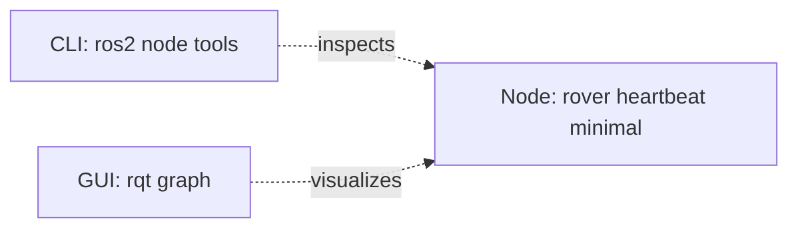

# Lesson 3 ROS 2 CLI and Introspection

## Lesson Goal

By the end of this lesson, you will be able to run a ROS 2 node, check that it is alive with CLI tools, inspect it by name, rename it at runtime, and view it with `rqt_graph`.

## Why This Matters

When you build robot software, guessing is expensive.

A rover can have many small programs running at the same time: one for heartbeat, one for sensors, one for motor commands, one for diagnostics, and more later. If something is not working, your first question should often be:

> Can ROS 2 actually see the node I think is running?

This lesson teaches **introspection**, which means using tools to inspect a running ROS 2 system. You will use terminal commands first, then a lightweight visual tool called `rqt_graph`.

This is still a beginner and low-storage lesson. You do not need Gazebo, Navigation2, MoveIt, Docker, YOLO, AI packages, large simulation worlds, or a full desktop robotics stack.

## Before You Start

You need:

- Ubuntu 24.04 LTS.
- ROS 2 Jazzy base installed.
- The `~/ros2_ws` workspace from Lesson 1.
- The `rover_core` package from Lesson 1.
- The `rover_heartbeat_minimal` node from Lesson 2.
- A terminal inside Ubuntu.
- Internet access for installing `rqt` and `rqt_graph`, if they are not installed yet.

You will use multiple terminals in this lesson.

- **Terminal 1:** run a heartbeat node.
- **Terminal 2:** inspect the node with ROS 2 CLI commands.
- **Terminal 3:** later, run a second renamed heartbeat node.

> **Important**
>
> Run ROS 2 commands inside Ubuntu. If you are using macOS plus an Ubuntu VM, keep the actual ROS 2 workspace inside Ubuntu at `~/ros2_ws`.

## New Words

**Introspection:** Looking at a running ROS 2 system using tools. It means asking ROS 2, "What can you see right now?"

**What it is not:** Introspection is not editing code. It is not guessing from memory. It is checking the live system.

**Tiny rover example:** If your rover heartbeat node is supposed to be alive, `ros2 node list` can help prove whether ROS 2 can see it.

**ROS graph:** The live map of ROS 2 nodes and their communication connections.

**Student note:** In this lesson, the graph is simple because we are mostly looking at nodes. It becomes more interesting in Lesson 4 when topics are introduced.

**Node name:** The runtime name of a running ROS 2 node.

**Runtime name:** The name a node uses while it is running. You can sometimes change this name when starting the node.

**Remapping:** A ROS 2 startup feature that lets you change certain names, such as a node name, without editing the source code.

**`rqt`:** A lightweight ROS 2 graphical tool that can load different debugging plugins.

**`rqt_graph`:** A visual tool that shows the ROS graph.

> **Student note**
>
> A Python file sitting in a folder is not automatically visible to ROS 2. A node appears in the ROS graph only while the program is actually running.

## Big Idea

In Lesson 2, you made one small node:

```text
rover_heartbeat_minimal
```

In this lesson, you will inspect that same node instead of writing new code.

Here is the tiny system you are checking:



**How to read this:** The heartbeat node is the running ROS 2 program. The CLI tools and `rqt_graph` are not rover nodes. They are tools you use to inspect what ROS 2 can see.

This is a **Dann ROS 2 Graph**, which is this course's beginner drawing convention. It is not an official ROS 2 standard name. In this diagram, rectangles are programs or tools, and dotted arrows mean "observes" or "inspects."

> **Beginner reminder**
>
> If a command prints nothing after `source`, that usually means it worked. Many setup commands are quiet when successful.

## Step 1: Open Terminal 1 and Source ROS 2

Open a terminal inside Ubuntu.

First, check whether the terminal already knows about ROS 2 Jazzy:

```bash
echo $ROS_DISTRO
```

Expected output:

```text
jazzy
```

If the output is blank, run:

```bash
source /opt/ros/jazzy/setup.bash
```

This command usually prints nothing when it works.

Now source your local workspace:

```bash
source ~/ros2_ws/install/setup.bash
```

This also usually prints nothing when it works. It tells this terminal where to find your own packages, such as `rover_core`.

## Step 2: Run the Heartbeat Node

In Terminal 1, run the node from Lesson 2:

```bash
ros2 run rover_core rover_heartbeat_minimal
```

Expected success sign:

```text
[INFO] ... Rover heartbeat: core system is alive
```

The exact timestamp and formatting may be different. That is okay. The important sign is that heartbeat messages keep appearing.

Leave this terminal running.

> **Student note**
>
> Do not press `Ctrl+C` yet. If you stop the node, ROS 2 will no longer see it. That is useful later, but for now we need the node alive.

## Step 3: Open Terminal 2 and Inspect the Running Node

Open a second Ubuntu terminal.

Source ROS 2:

```bash
source /opt/ros/jazzy/setup.bash
```

Source your workspace:

```bash
source ~/ros2_ws/install/setup.bash
```

Now ask ROS 2 which nodes are running:

```bash
ros2 node list
```

Expected output:

```text
/rover_heartbeat_minimal
```

**How to read this:** The leading `/` is normal. It means the node is in the root namespace. You do not need to master namespaces yet.

> **Student note**
>
> That's a good question if you are wondering what a namespace is. We will use names more deeply later, especially as systems get larger. For now, the short version is: the slash is part of the full node name shown by ROS 2.

## Step 4: Inspect One Node by Name

In Terminal 2, run:

```bash
ros2 node info /rover_heartbeat_minimal
```

You may see output with headings like:

```text
/rover_heartbeat_minimal
  Subscribers:

  Publishers:

  Service Servers:

  Service Clients:

  Action Servers:

  Action Clients:
```

Your exact output may include extra ROS 2 internal details. That is normal.

**What this proves:** ROS 2 can find the node by name and report runtime information about it.

> **Future topic**
>
> That's a good question if you are wondering about publishers, subscribers, services, clients, or actions. We will study topics in Lesson 4 and services in Lesson 5, so you do not need to master those yet. For now, remember the practical idea: `ros2 node info` shows details about a live node.

## Step 5: Stop the Node and Watch It Disappear

Go back to Terminal 1, where the heartbeat is running.

Press:

```text
Ctrl+C
```

Now return to Terminal 2 and run:

```bash
ros2 node list
```

Expected success sign:

- `/rover_heartbeat_minimal` should no longer appear.

This is an important idea: a node appears in the ROS graph only while it is running.

## Step 6: Rename the Node at Runtime

Now start the same node again, but give it a different runtime name.

In Terminal 1, run:

```bash
ros2 run rover_core rover_heartbeat_minimal --ros-args -r __node:=front_rover_heartbeat
```

Leave it running.

In Terminal 2, run:

```bash
ros2 node list
```

Expected output:

```text
/front_rover_heartbeat
```

The same executable is running, but the node name is different.

**How to read the command:**

- `ros2 run rover_core rover_heartbeat_minimal` starts the same console script as before.
- `--ros-args` means "the next arguments are for ROS 2."
- `-r` means "remap something."
- `__node:=front_rover_heartbeat` changes the runtime node name.

> **Student note**
>
> Runtime renaming does not edit your Python file. It only changes the name for this run of the program.

## Step 7: Inspect the Renamed Node

In Terminal 2, run:

```bash
ros2 node info /front_rover_heartbeat
```

Expected success sign:

- ROS 2 prints information about `/front_rover_heartbeat`.
- It does not need to show `/rover_heartbeat_minimal`, because that is not the current runtime name.

Tiny rover example:

- The same heartbeat code could be used to test a front subsystem.
- The runtime name `front_rover_heartbeat` helps you identify that copy.

Think of it like a name tag. The job is the same, but the name tag tells you which running copy you are looking at.

## Step 8: Run a Second Renamed Copy

Open Terminal 3.

Source ROS 2:

```bash
source /opt/ros/jazzy/setup.bash
```

Source your workspace:

```bash
source ~/ros2_ws/install/setup.bash
```

Run another copy of the same heartbeat executable with a different node name:

```bash
ros2 run rover_core rover_heartbeat_minimal --ros-args -r __node:=test_rover_heartbeat
```

Now Terminal 1 should be running:

```text
front_rover_heartbeat
```

Terminal 3 should be running:

```text
test_rover_heartbeat
```

In Terminal 2, check the live nodes:

```bash
ros2 node list
```

Expected output:

```text
/front_rover_heartbeat
/test_rover_heartbeat
```

The order may be different. That is okay.

## Step 9: Inspect Both Nodes

In Terminal 2, inspect the first renamed node:

```bash
ros2 node info /front_rover_heartbeat
```

Then inspect the second renamed node:

```bash
ros2 node info /test_rover_heartbeat
```

Expected success signs:

- Both commands return node information.
- Neither command says the node cannot be found.

This proves that ROS 2 sees two separate live nodes, even though they came from the same executable.

## Step 10: Install `rqt` and `rqt_graph`

Now that you have live nodes to inspect, install the lightweight graph tools.

In Terminal 2, run:

```bash
sudo apt update
```

Then run:

```bash
sudo apt install ros-jazzy-rqt ros-jazzy-rqt-graph
```

If Ubuntu asks for your password, type it and press `Enter`. The password may not visibly appear while you type. That is normal.

If Ubuntu asks whether to continue, press:

```text
Y
```

These tools are small compared with full simulation and desktop robotics stacks. This is the planned point in the course where a visual graph becomes useful.

## Step 11: Open `rqt_graph`

Keep the two heartbeat nodes running in Terminal 1 and Terminal 3.

In Terminal 2, run:

```bash
rqt_graph
```

A window should open.

Expected success signs:

- You see a graph window.
- You can see the running heartbeat nodes after the graph refreshes.
- If the graph looks empty, look for a refresh button and refresh the view.

> **Student note**
>
> `rqt_graph` shows what ROS 2 can see right now. If a node is stopped, it should disappear from the graph. If no nodes are running, the graph may look empty.

## Step 12: Try the General `rqt` Tool

You can also open the general `rqt` application:

```bash
rqt
```

Inside `rqt`, the graph viewer is one plugin among many. For now, you do not need to explore every plugin.

The beginner goal is simple:

- know that `rqt_graph` exists;
- know that it visualizes the ROS graph;
- know that CLI tools are still important.

> **Future topic**
>
> That's a good question if you are wondering why the graph is not showing many connections yet. We will study topics properly in Lesson 4. For now, the short version is: topics are named channels for messages between nodes, and the graph becomes more useful as nodes start publishing and subscribing.

## Minimal Code

No new code is required in this lesson.

You are reusing the node from Lesson 2:

```bash
ros2 run rover_core rover_heartbeat_minimal
```

That is intentional. This lesson is about inspecting and debugging runtime behavior, not writing another node.

## Run It

For the full two-node practice, run these in separate terminals.

Terminal 1:

```bash
source /opt/ros/jazzy/setup.bash
source ~/ros2_ws/install/setup.bash
ros2 run rover_core rover_heartbeat_minimal --ros-args -r __node:=front_rover_heartbeat
```

Terminal 3:

```bash
source /opt/ros/jazzy/setup.bash
source ~/ros2_ws/install/setup.bash
ros2 run rover_core rover_heartbeat_minimal --ros-args -r __node:=test_rover_heartbeat
```

Leave both terminals running.

## Verify It

In Terminal 2:

```bash
source /opt/ros/jazzy/setup.bash
source ~/ros2_ws/install/setup.bash
ros2 node list
```

Expected success signs:

- `/front_rover_heartbeat` appears.
- `/test_rover_heartbeat` appears.

Inspect each node:

```bash
ros2 node info /front_rover_heartbeat
```

```bash
ros2 node info /test_rover_heartbeat
```

Expected success signs:

- Both commands print node information.
- Neither command says the node was not found.

Open the visual graph:

```bash
rqt_graph
```

Expected success signs:

- A graph window opens.
- The running nodes appear after refresh.

Now stop one node with `Ctrl+C`, then run:

```bash
ros2 node list
```

Expected success sign:

- The stopped node disappears from the list.

## Common Mistakes

- **Forgetting to source a new terminal:** Every new terminal may need `source /opt/ros/jazzy/setup.bash` and `source ~/ros2_ws/install/setup.bash`.
- **Stopping the node too early:** If the heartbeat program is not running, `ros2 node list` will not show it.
- **Expecting runtime renaming to edit the code:** `__node:=front_rover_heartbeat` changes the name only for that run.
- **Using the wrong node name with `ros2 node info`:** Use `ros2 node list` first, then copy the exact name.
- **Running two nodes in one terminal:** A terminal running a node is busy showing that node's output. Use separate terminals for separate long-running nodes.
- **Thinking `rqt_graph` replaces the CLI:** The graph is useful, but CLI commands are still the clearest way to verify exact names.
- **Expecting a complex graph too early:** This lesson happens before topics and services. A simple graph is normal.

## Troubleshooting

| Symptom | Likely cause | Fix | How to verify |
|---|---|---|---|
| `ros2: command not found` | ROS 2 was not sourced | Run `source /opt/ros/jazzy/setup.bash` | `ros2 --help` shows help text |
| `Package 'rover_core' not found` | Workspace was not sourced or package was not built | Run `cd ~/ros2_ws`, `colcon build --packages-select rover_core`, then `source install/setup.bash` | `ros2 pkg list | grep rover_core` prints `rover_core` |
| `ros2 node list` is empty | No node is running | Start the heartbeat node in another terminal | `/rover_heartbeat_minimal` or a renamed node appears |
| `ros2 node info` cannot find the node | Wrong name or stopped node | Run `ros2 node list` and copy the exact name | `ros2 node info <exact_name>` prints details |
| Only one renamed node appears | One node was stopped or not started in a separate terminal | Start each renamed node in its own sourced terminal | `ros2 node list` shows both names |
| `rqt_graph: command not found` | `rqt_graph` is not installed | Run `sudo apt install ros-jazzy-rqt ros-jazzy-rqt-graph` | `rqt_graph` opens |
| `rqt_graph` opens but looks empty | No nodes are running or graph needs refresh | Start a node and refresh the graph | `ros2 node list` and `rqt_graph` both show nodes |
| You see unfamiliar publishers, services, or clients | ROS 2 has built-in runtime interfaces | Do not worry about mastering them yet | You can still identify the node name |

## Simple Exercise or Mini-Project

**Mini-project name:** Two Heartbeats, One Graph

**Goal:** Prove that ROS 2 can see two running copies of the same heartbeat executable when each copy has a different runtime node name.

**Task:** Run two heartbeat nodes:

- `front_rover_heartbeat`
- `test_rover_heartbeat`

Then prove they are visible with CLI tools and `rqt_graph`.

**Requirements:**

- Use at least three terminals.
- Source ROS 2 and the workspace in each terminal that needs ROS 2 commands.
- Run each heartbeat node with a different runtime name.
- Use `ros2 node list`.
- Use `ros2 node info` on both node names.
- Open `rqt_graph`.

**Success criteria:**

- `ros2 node list` shows both renamed nodes.
- `ros2 node info /front_rover_heartbeat` works.
- `ros2 node info /test_rover_heartbeat` works.
- `rqt_graph` shows the running nodes after refresh.
- Stopping one node removes it from the node list.

**Optional hint:** If the graph is confusing, trust the CLI first. Run `ros2 node list`, then refresh `rqt_graph`.

**What you should decide on your own:** Decide which node to stop first and how you will prove that the graph changed after stopping it.

**One-minute explanation:** Explain your result using these prompts:

- Which terminals were running nodes?
- Which terminal inspected the nodes?
- What changed when you stopped one node?
- What did `rqt_graph` make easier to see?

## Recap

- A node is visible in ROS 2 only while it is running.
- `ros2 node list` shows live node names.
- `ros2 node info <node_name>` inspects one live node.
- Runtime remapping can rename a node without changing the Python file.
- Two running copies of the same executable can have different node names.
- `rqt_graph` gives a visual view of the ROS graph.
- CLI tools are still important even when visual tools are available.

## Checkpoint Questions

- What does `ros2 node list` prove?
- Why does a node disappear from `ros2 node list` after you stop the program?
- What is the difference between the executable name and the runtime node name?
- What does `--ros-args -r __node:=front_rover_heartbeat` do?
- Why might a robotics developer run two copies of the same node with different names?
- What does `ros2 node info` show that `ros2 node list` does not?
- What is `rqt_graph` useful for?
- If `rqt_graph` is empty, what are two things you should check first?

## Student Pacing Review

This lesson briefly mentions publishers, subscribers, services, clients, actions, topics, namespaces, and graph connections.

You do not need to master those yet.

- Topics are taught in Lesson 4.
- Services are taught in Lesson 5.
- Larger graph connections become clearer after topics and services are practiced.

For now, focus on this practical skill: start a node, inspect it, rename it, and prove what ROS 2 can see.

## Mermaid Verification Review

This lesson includes one Mermaid diagram.

- The diagram uses `flowchart LR`.
- Node IDs are simple ASCII names: `heartbeat_node`, `node_cli`, and `graph_gui`.
- Labels with spaces and punctuation are quoted.
- Arrows use simple Mermaid dotted arrow syntax.
- The diagram is intentionally small for GitHub and VS Code Markdown preview.
