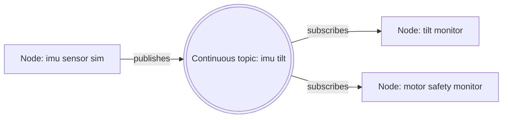

# Lesson 4 Topics

## Lesson Goal

By the end of this lesson, you will be able to make one ROS 2 Python node publish repeated fake IMU tilt data, make another node receive it, inspect the live data with ROS 2 CLI tools, and make a small safety decision from that data.

## Why This Matters

Robots constantly produce information. An IMU reports tilt, an encoder reports wheel movement, and a controller may repeatedly send a velocity command. A **topic** is ROS 2's normal way to move this kind of ongoing data between small programs.

In this lesson, the data is deliberately simple text instead of real hardware data. That lets you learn the communication pattern first. Later, the same pattern can carry a real IMU reading or a carefully designed custom message.

This is still a low-storage lesson. You need ROS 2 Jazzy, your existing Python package, terminals, and the lightweight `rqt_graph` tool installed in Lesson 3. You do **not** need Gazebo, Navigation2, MoveIt, Docker, AI packages, or a full desktop robotics stack.

## Before You Start

You need:

- Ubuntu 24.04 LTS with ROS 2 Jazzy.
- The `~/ros2_ws` workspace and `rover_core` package from Lessons 1 and 2.
- A terminal inside Ubuntu and a text editor.
- Two terminals for the publisher and subscriber; a third terminal is helpful for inspection.
- `rqt_graph` from Lesson 3, only if you want the optional visual check.

Each terminal that runs ROS 2 commands needs this setup:

```bash
source /opt/ros/jazzy/setup.bash
source ~/ros2_ws/install/setup.bash
```

> **Beginner reminder**
>
> `source` normally prints no output when it succeeds. That quiet result is normal. `echo $ROS_DISTRO` should print `jazzy` after the first command.

## New Words

**Topic:** A named channel for messages that arrive over time.

- **It is:** a route that publishers put messages into and subscribers listen to.
- **It is not:** a Python variable shared directly between files, or a guarantee that a subscriber receives every historical message.
- **Tiny rover example:** `/imu/tilt` carries repeated tilt readings from an IMU node to a monitor node.
- **Analogy:** Think of a radio station. The topic name is the station; publishers broadcast on it, and subscribers tune in.

**Publisher:** A node that sends messages to a topic. In this lesson, `imu_sensor_sim` publishes fake tilt data.

**Subscriber:** A node that receives messages from a topic. In this lesson, `tilt_monitor` and `motor_safety_monitor` subscribe to the fake tilt data.

**Message:** One piece of data sent through a topic. We will use `std_msgs/msg/String`, which carries text.

> **Student note**
>
> **The Vehicle & Road Analogy:** Think of the **Publisher** as the origin (where the vehicle starts), the **Topic** as the road (the route), the **Message** as the vehicle (the data/cargo), and the **Subscriber** as the destination. In ROS 2, because a topic is a broadcast channel, a copy of the vehicle's cargo is delivered to every destination (subscriber) along that road.

**Callback:** A function ROS 2 calls when an event happens. A subscriber callback runs when a new message arrives; a timer callback runs at a repeating interval.

**Topic name:** The shared name that connects publishers and subscribers. Both nodes must use the same name and compatible message type. Here it is `/imu/tilt`.

> **Student note**
>
> A topic is not the publisher node and is not the subscriber node. It is the named communication channel between them.

## Big Idea

One publisher can send the same stream to more than one subscriber. The publisher does not need special code for each listener.



This is a **Dann ROS 2 Graph**, the course's drawing convention—not an official ROS 2 standard name. **How to read it:** rectangles are nodes; the double circle is a repeated, sensor-like topic; arrows show publishing and subscribing. The two subscriber arrows mean both nodes can receive the same new message.

> **Beginner reminder**
>
> The topic does not make a motor move. In this lesson, the safety node only logs a decision. Real hardware control comes later, after you are comfortable with safe software communication.

## Step 1: Check Your Existing Package

Open a terminal and source ROS 2 and your workspace:

```bash
source /opt/ros/jazzy/setup.bash
source ~/ros2_ws/install/setup.bash
cd ~/ros2_ws
ls src/rover_core/rover_core
```

You should see your package's Python folder. If `rover_core` is missing, complete Lesson 1 before continuing.

## Step 2: Create the Fake IMU Publisher

Move into the package's Python folder and create the file:

```bash
cd ~/ros2_ws/src/rover_core/rover_core
nano imu_sensor_sim.py
```

Paste this minimal publisher:

```python
import rclpy
from rclpy.node import Node
from std_msgs.msg import String


class ImuSensorSim(Node):
    """
    A ROS 2 Node that simulates an Inertial Measurement Unit (IMU) sensor.
    It publishes simulated pitch and roll (tilt) readings to the '/imu/tilt' topic
    every second as String messages.
    """

    def __init__(self):
        # Initialize the node with the name 'imu_sensor_sim'
        super().__init__('imu_sensor_sim')
        
        # Create a publisher on the '/imu/tilt' topic using String messages
        # A queue size of 10 is used for QoS (Quality of Service)
        self.publisher = self.create_publisher(String, '/imu/tilt', 10)
        
        # Create a timer that calls the publish_tilt method every 1.0 second
        self.timer = self.create_timer(1.0, self.publish_tilt)
        
        # List of fake tilt readings to simulate sensor data
        self.readings = [
            'pitch: 5.0, roll: -2.0',
            'pitch: 8.0, roll: 1.0',
            'pitch: 16.0, roll: 3.0',
            'pitch: 4.0, roll: -12.0',
        ]
        self.index = 0

    def publish_tilt(self):
        """Timer callback that publishes the next fake tilt reading."""
        message = String()
        message.data = self.readings[self.index]
        
        # Publish the simulated readings message
        self.publisher.publish(message)
        
        # Log the published data to the console
        self.get_logger().info(f'Published tilt: {message.data}')
        
        # Cycle through the simulated readings list
        self.index = (self.index + 1) % len(self.readings)


def main(args=None):
    # Initialize the ROS 2 Python client library
    rclpy.init(args=args)
    
    # Instantiate the node
    node = ImuSensorSim()
    
    try:
        # Keep the node alive and processing callbacks
        rclpy.spin(node)
    except KeyboardInterrupt:
        # Gracefully handle Ctrl+C
        pass
    finally:
        # Destroy the node explicitly and clean up rclpy
        node.destroy_node()
        rclpy.shutdown()


if __name__ == '__main__':
    main()
```

### What the Important Lines Do

- **`super().__init__('imu_sensor_sim')`**: Initializes the base `Node` class and registers the node's official name as `imu_sensor_sim` in the ROS 2 graph.
- **`from std_msgs.msg import String`**: Imports the standard ROS 2 message type used here to hold text. In ROS 2, every topic must declare a specific message type.
- **`create_publisher(String, '/imu/tilt', 10)`**: Establishes the communication pipe. It tells ROS 2 that this node will publish `String` messages on the `/imu/tilt` topic. The `10` is the **Queue Size** (QoS history depth), which acts as a buffer holding up to 10 messages if the network slows down.
- **`create_timer(1.0, self.publish_tilt)`**: Sets up a heartbeat timer. Every `1.0` second, ROS 2 will automatically trigger the `publish_tilt()` callback function.
- **`self.publisher.publish(message)`**: Actually broadcasts the message onto the topic. Any subscriber listening on `/imu/tilt` will instantly receive it.
- **`self.get_logger().info(...)`**: Prints the status to the terminal. In ROS 2, we use logger functions (like `.info()`) instead of standard Python `print()` to categorize and format output.
- **`rclpy.spin(node)`**: Keeps the node running in an infinite loop so it can listen for timer events and run callbacks. Without this, the node would exit immediately.

> **Future topic**
>
> You may wonder why we send text instead of separate numeric pitch and roll fields. We will create clearer custom messages in Phase 6. For now, the short version is: `String` keeps the first topic example easy to read in the terminal. Focus on the publish-and-subscribe flow.

> **Vibe coding tip**
>
> If you are using an AI coding assistant to generate your ROS 2 files instead of writing them from scratch, you can prompt the AI to write the node file and update your `setup.py` in one go.
>
> **The Prompt Rule of Thumb:** Always specify the **Three Connections** in your prompt:
> 1. **Node Name:** The name of the node (e.g., `imu_sensor_sim`).
> 2. **Topic Name:** The channel it communicates on (e.g., `/imu/tilt`).
> 3. **Message Type:** The format of the data it sends (e.g., `std_msgs/msg/String`).
>
> *Example Prompt:* "Write a class-based ROS 2 Python node called `imu_sensor_sim` that publishes fake tilt readings to the topic `/imu/tilt` using `String` messages every second. Also, add the entry point for this node to the console_scripts of my `setup.py` file."

## Step 3: Register the Publisher and Build

Open `setup.py`:

```bash
cd ~/ros2_ws/src/rover_core
nano setup.py
```

Inside its existing `console_scripts` list, add this line (keep entries from earlier lessons):

```python
'imu_sensor_sim = rover_core.imu_sensor_sim:main',
```

Build only this small package:

```bash
cd ~/ros2_ws
colcon build --packages-select rover_core
source install/setup.bash
```

`colcon build` creates the runnable ROS 2 package files. Sourcing `install/setup.bash` refreshes this terminal so it can find the newly registered command.

**Success sign:** the build ends with a summary showing `rover_core` finished. A warning is not automatically a failure; an error that ends the build needs attention.

## Step 4: Run and Inspect the Publisher

In Terminal 1, run:

```bash
source /opt/ros/jazzy/setup.bash
source ~/ros2_ws/install/setup.bash
ros2 run rover_core imu_sensor_sim
```

Expected output repeats approximately once per second:


```text
[INFO] ... Published tilt: pitch: 5.0, roll: -2.0
```

In Terminal 2, source ROS 2 and the workspace, then list topics:

```bash
source /opt/ros/jazzy/setup.bash
source ~/ros2_ws/install/setup.bash
ros2 topic list
```

Expected success sign: `/imu/tilt` appears. You will also see built-in topics such as `/rosout` and `/parameter_events`; that is normal.

Ask ROS 2 for the topic type and current endpoint counts:

```bash
ros2 topic info /imu/tilt
```

Before a subscriber starts, the useful part looks like this:

```text
Type: std_msgs/msg/String
Publisher count: 1
Subscription count: 0
```

Then watch the live stream directly:

```bash
ros2 topic echo /imu/tilt
```

> **Important**
>
> `ros2 topic echo <topic_name>` is one of the most powerful debugging commands in ROS 2. It lets you tap into the topic "road" and view the live data stream in real-time, proving that your publisher is actively working.

Expected output repeats:


```text
data: 'pitch: 5.0, roll: -2.0'
---
```

Press `Ctrl+C` in the echo terminal when you are ready to continue. This stops only `ros2 topic echo`, not the publisher in Terminal 1.

## Step 5: Create the Tilt Monitor Subscriber

> **Vibe coding tip**
>
> To prompt an AI coding assistant to generate this subscriber node and register it, you can use a prompt like this:
>
> *Example Prompt:* "Write a class-based ROS 2 Python node named `tilt_monitor` that subscribes to the topic `/imu/tilt` using `String` messages. It should log all received messages to the terminal. Also, register this node in the `console_scripts` section of `setup.py`."

### What This Subscriber Code Does (The Big Picture)

As a whole, this script creates a **listener node** (`tilt_monitor`). Once started, it connects to the `/imu/tilt` topic and sits quietly in the background. The moment a new message is published, this node automatically wakes up, reads the text, and displays it on your terminal screen. It repeats this cycle indefinitely until you stop it.

Create a second Python file:

```bash
cd ~/ros2_ws/src/rover_core/rover_core
nano tilt_monitor.py
```

Paste this code:

```python
import rclpy
from rclpy.node import Node
from std_msgs.msg import String


class TiltMonitor(Node):
    def __init__(self):
        super().__init__('tilt_monitor')
        self.subscription = self.create_subscription(
            String,
            '/imu/tilt',
            self.tilt_callback,
            10,
        )

    def tilt_callback(self, message):
        self.get_logger().info(f'Received tilt: {message.data}')


def main(args=None):
    rclpy.init(args=args)
    node = TiltMonitor()
    try:
        rclpy.spin(node)
    except KeyboardInterrupt:
        pass
    finally:
        node.destroy_node()
        rclpy.shutdown()


if __name__ == '__main__':
    main()
```

### What the Important Lines Do

- **`create_subscription(String, '/imu/tilt', self.tilt_callback, 10)`**: Establishes the listener. This tells ROS 2 to watch the `/imu/tilt` topic for `String` messages. Whenever a new message arrives, ROS 2 will automatically trigger the `self.tilt_callback` function.
- **`tilt_callback(self, message)`**: The callback function that runs automatically every time a new message is received. ROS 2 hands over the received message package as the `message` argument.
- **`message.data`**: Extracts the actual text payload from the received ROS 2 message.
- **`self.get_logger().info(...)`**: Prints the received sensor values to the terminal screen so you can monitor the readings in real-time.

Register it in `setup.py`:

```python
'tilt_monitor = rover_core.tilt_monitor:main',
```

Build and re-source:

```bash
cd ~/ros2_ws
colcon build --packages-select rover_core
source install/setup.bash
```

The subscriber uses the same **message type** and the same **topic name** as the publisher. That agreement is what lets them communicate.

## Step 6: Run Both Nodes and Verify the Connection

Leave `imu_sensor_sim` running in Terminal 1. In Terminal 2, run:

```bash
source /opt/ros/jazzy/setup.bash
source ~/ros2_ws/install/setup.bash
ros2 run rover_core tilt_monitor
```

Expected output repeats as messages arrive:

```text
[INFO] ... Received tilt: pitch: 5.0, roll: -2.0
```

In Terminal 3, inspect the live system:

```bash
source /opt/ros/jazzy/setup.bash
source ~/ros2_ws/install/setup.bash
ros2 node list
ros2 topic info /imu/tilt
ros2 topic hz /imu/tilt
```

Expected success signs:

- `/imu_sensor_sim` and `/tilt_monitor` appear in `ros2 node list`.
- `ros2 topic info /imu/tilt` reports one publisher and one subscription.
- `ros2 topic hz /imu/tilt` eventually estimates a rate near `1.0 Hz`. The exact number can vary slightly because it is a measurement.


> **Important**
>
> `ros2 topic hz <topic_name>` acts as a **message speedometer**. Checking the frequency (Hz) is highly useful in robotics for verifying that sensors and controllers are sending data consistently. If a camera or lidar stream lags or drops below its expected rate (e.g. due to CPU overload), a robot could react too slowly to obstacles.

`ros2 topic hz` means “how often are messages arriving?” Here, **Hz** means messages per second.

Optional visual check:

You can launch the Node Graph directly:

```bash
rqt_graph
```

Or, you can open the main **rqt** dashboard and select the Node Graph plugin from the menu (**Plugins -> Introspection -> Node Graph**):

```bash
rqt
```


Refresh the window if necessary. You should see the publisher and subscriber connected through `/imu/tilt`.

> **Student note**
>
> `rqt_graph` is a helpful picture, but the CLI is still important. If the picture is confusing, `ros2 node list`, `ros2 topic info`, and `ros2 topic echo` give precise evidence.

## Step 7: Add a Simple Motor Safety Reaction

### What We Want to Achieve (The Goal)

We want to build a **Safety Watchdog** for our robot to prevent it from tipping over.
* **The Problem:** If the rover climbs a hill that is too steep, it could flip over and damage itself.
* **The Solution:** We create a node (`motor_safety_monitor`) that continuously listens to the `/imu/tilt` topic. It reads the pitch and roll numbers. If the robot tilts more than **10 degrees** in any direction (higher than `10.0` or lower than `-10.0`), it triggers a safety warning.

> **Vibe coding tip**
>
> As a vibe coder, you don't need to write the complex text-parsing or math code yourself. Just describe the **safety rule** in plain English to the AI.
>
> *Example Simple Prompt:* "Write a ROS 2 Python node named `motor_safety_monitor`. It should listen to the `/imu/tilt` topic for text messages containing pitch and roll angles. If either value goes above 10 or below -10, print a warning. Otherwise, print that it is safe to continue. Also, register this node in my `setup.py` file."

Create the file:

```bash
cd ~/ros2_ws/src/rover_core/rover_core
nano motor_safety_monitor.py
```

```python
import re

import rclpy
from rclpy.node import Node
from std_msgs.msg import String


class MotorSafetyMonitor(Node):
    def __init__(self):
        super().__init__('motor_safety_monitor')
        self.subscription = self.create_subscription(
            String,
            '/imu/tilt',
            self.tilt_callback,
            10,
        )

    def tilt_callback(self, message):
        numbers = re.findall(r'-?\d+\.\d+', message.data)
        if len(numbers) != 2:
            self.get_logger().warning(f'Could not read tilt: {message.data}')
            return

        pitch, roll = (float(number) for number in numbers)
        if abs(pitch) > 10.0 or abs(roll) > 10.0:
            self.get_logger().warning(
                f'SAFETY WARNING: high tilt. pitch={pitch}, roll={roll}'
            )
        else:
            self.get_logger().info(
                f'Safe to continue. pitch={pitch}, roll={roll}'
            )


def main(args=None):
    rclpy.init(args=args)
    node = MotorSafetyMonitor()
    try:
        rclpy.spin(node)
    except KeyboardInterrupt:
        pass
    finally:
        node.destroy_node()
        rclpy.shutdown()


if __name__ == '__main__':
    main()
```

Add this console script entry to `setup.py`:

```python
'motor_safety_monitor = rover_core.motor_safety_monitor:main',
```

Then build and source again:

```bash
cd ~/ros2_ws
colcon build --packages-select rover_core
source install/setup.bash
```

Run it in a new terminal while the IMU simulator remains running:

```bash
source /opt/ros/jazzy/setup.bash
source ~/ros2_ws/install/setup.bash
ros2 run rover_core motor_safety_monitor
```

Expected success signs:


- Safe readings produce `Safe to continue`.
- The simulated `pitch: 16.0` reading produces a safety warning.
- The simulated `roll: -12.0` reading produces a safety warning.
- `ros2 topic info /imu/tilt` now reports one publisher and **two** subscriptions.

`re.findall(...)` is ordinary Python used only because our first message is text. You do not need to master regular expressions yet; it finds the two decimal numbers in the known message format.

> **Future topic**
>
> That's a good question if you are asking how a real safety node would stop motors. We will study clearer motor command messages in Phase 6, parameters in Phase 7, and full system startup in Phase 8. For now, the short version is: a safety node observes sensor data and can decide that a condition is unsafe. In this lesson, focus on proving that the decision node receives the topic stream.

## Step 8: Reuse the Publisher with Topic Remapping

> **Why Remapping Matters (Practical Use)**
>
> Imagine you have a robot with **two identical IMU sensors** (a front IMU and a rear IMU). Instead of copy-pasting your Python script into two separate files to change the topic names, you write **one single generic code file**. 
>
> At startup, you run the same script twice but "remap" (redirect) the topic names in the terminal. This keeps your code clean and avoids duplicate files.

### Generalized Remapping Syntax

The general way to rename a topic at startup is:

```bash
ros2 run <package_name> <executable_name> --ros-args -r <old_topic>:=<new_topic>
```

* `--ros-args`: Tells ROS 2 that the flags following this belong to the ROS 2 system, not your Python code.
* `-r`: Stands for **Remap** (rename).
* `<old_topic>:=<new_topic>`: Tells ROS 2 to replace any instance of the old topic name with the new one.

### Activity: Remap the IMU Publisher

Stop your current publisher in Terminal 1 with `Ctrl+C`, then run the exact same program but redirect its messages to `/front_imu` instead of `/imu/tilt`:

```bash
ros2 run rover_core imu_sensor_sim --ros-args -r /imu/tilt:=/front_imu
```

**What happened?**
You will see messages streaming on `/front_imu` instead of `/imu/tilt`. 

If you open `rqt_graph` now, you will notice that the connection arrow between your nodes has completely disappeared! The nodes are now floating with no line connecting them.

<!-- Space for user screenshot: Disconnected rqt_graph -->


#### Why Did the Connection Break?
The connection broke because the nodes are no longer sharing the same channel:
* `/imu_sensor_sim` is publishing on `/front_imu`.
* `/motor_safety_monitor` and `/tilt_monitor` are still listening to `/imu/tilt`.

> **Important: Node Names vs. Topic Names in rqt_graph**
>
> * **Oval shapes = Nodes** (programs). In the graph, these stay `/imu_sensor_sim` and `/motor_safety_monitor`.
> * **Arrows & Text labels = Topics** (communication channels). 
>
> Since they don't share a topic name anymore, `rqt_graph` draws no arrow between them.

---

### How to Keep the Connection Active

To keep the nodes connected when remapping, **you must remap both the publisher and the subscriber to the same new topic**.

Stop your subscriber in Terminal 2 and run it again with the same remapping argument:

```bash
ros2 run rover_core tilt_monitor --ros-args -r /imu/tilt:=/front_imu
```

Refresh your `rqt_graph` window. The connection arrow will reappear, now showing the communication flowing through `/front_imu`!


**What this proves:** The same executable can be reused for a front IMU, rear IMU, or test IMU by changing its runtime topic name.

## Step 9: Record and Replay a Short Topic Stream

ROS 2 bags save topic messages for later playback. Think of it like a **voice recorder for your robot** — while it is running, every message published on a topic gets saved to a file on your computer. When you press stop, you have a recording you can play back later, and your subscriber nodes will receive those messages exactly as if the robot were live right now.

First, make sure a publisher is running on `/imu/tilt` again. If you remapped it in Step 8, stop it and restart the original command:

```bash
ros2 run rover_core imu_sensor_sim
```

In a separate terminal, record for about 10 seconds:

```bash
cd ~/ros2_ws
ros2 bag record /imu/tilt
```

> [!IMPORTANT]
> `ros2 bag record /imu/tilt` is one of the most useful commands in ROS 2.
> It listens to the `/imu/tilt` topic and saves every message it receives into a timestamped folder on your computer.
> You can replay that folder later — without a robot, without a simulator — and your subscriber nodes will behave exactly as if data were coming in live.

The recorder creates a time-stamped folder in the current directory. Press `Ctrl+C` after enough messages arrive. List the new bag folder:

```bash
ls -d rosbag2_*
```

Stop the IMU simulator. Then inspect the recording before replaying it:

```bash
ros2 bag info rosbag2_<your_timestamp>
```

Replace `<your_timestamp>` with the exact folder name printed by `ls`. Good output identifies `/imu/tilt`, `std_msgs/msg/String`, and a message count greater than zero.


Start `tilt_monitor` or `motor_safety_monitor` in another terminal, then replay the saved data:

```bash
ros2 bag play rosbag2_<your_timestamp>
```


**Success sign:** the monitor receives messages even though `imu_sensor_sim` is stopped. The bag player is now publishing the recorded messages.

> **Student note**
>
> A bag is not a database and it is not a replacement for a live sensor. It is a recording that is useful for repeatable debugging and testing.

> **Student note**
>
> Why is this useful later? When you build a real robot, you will not always want to drive it around every time you test new code. You record one good run of sensor data, then replay it as many times as you need while you fix your code at your desk. Real robotics teams do this constantly.

## How to Verify It

Use these checks while the relevant nodes are running:

```bash
ros2 node list
ros2 topic list
ros2 topic info /imu/tilt
ros2 topic echo /imu/tilt
ros2 topic hz /imu/tilt
```

Quick interpretation:

| Command | What good looks like | What it proves |
|---|---|---|
| `ros2 node list` | The expected node names appear | ROS 2 can see live programs |
| `ros2 topic list` | `/imu/tilt` appears | The topic exists while a node exposes it |
| `ros2 topic info /imu/tilt` | Correct type and endpoint counts | Nodes agree on the topic connection |
| `ros2 topic echo /imu/tilt` | Repeating `data:` messages | Actual messages are arriving |
| `ros2 topic hz /imu/tilt` | About `1.0 Hz` | The stream is arriving repeatedly |

## Common Mistakes

- **Forgetting to source after rebuilding:** `ros2 run` may not find a new console script until you run `source ~/ros2_ws/install/setup.bash` in that terminal.
- **Using different topic names:** `/imu/tilt` and `/imu_tilt` are different names. The publisher and subscriber must match exactly.
- **Using different message types:** A `String` publisher cannot directly connect to a subscriber expecting another type.
- **Stopping the publisher while expecting the monitor to receive live data:** the monitor stays running, but no new messages arrive until a publisher or bag player starts.
- **Expecting old messages after starting a subscriber:** normal topics mainly carry new messages. Start the subscriber first, then watch the next published readings.
- **Running the remapped publisher but the original subscriber:** the names no longer match; remap the subscriber too, or use the original topic name.
- **Treating a warning log as real motor control:** this lesson makes a software decision only. Never connect untested beginner code directly to motors.

## Troubleshooting

| Symptom | Likely cause | Fix | How to verify |
|---|---|---|---|
| `Package 'rover_core' not found` | Workspace is not built or sourced | Build from `~/ros2_ws`, then source `install/setup.bash` | `ros2 pkg list | rg rover_core` shows the package |
| `No executable found` | New console script is missing from `setup.py`, or terminal is stale | Check the entry, rebuild, and source again | `ros2 pkg executables rover_core` lists the node |
| `/imu/tilt` is missing | Publisher is not running or topic was remapped | Start the publisher and check its command | `ros2 topic list` shows the expected name |
| Monitor prints nothing | Publisher is stopped, type/name differs, or monitor started on the wrong remapped name | Run `ros2 topic echo` and compare exact names | `ros2 topic info` shows publisher and subscription counts |
| `ros2 topic hz` waits without output | No messages are arriving | Start a publisher and wait several seconds | A rate estimate appears after messages arrive |
| Safety node says it cannot read tilt | Message text was changed from the expected `pitch: number, roll: number` pattern | Restore the simulator text or update the parsing code | Log shows two numeric values were found |
| Bag replay produces nothing | Wrong bag directory, no recording, or monitor started too late | Use `ros2 bag info` and start monitor before play | Bag info shows messages and monitor logs output |
| `rqt_graph` is unavailable | It was not installed or GUI forwarding is unavailable in the VM | Use CLI checks first; install `ros-jazzy-rqt-graph` if appropriate | `ros2 topic info` still proves the connection |

## Simple Exercise or Mini-Project

**System name:** Two-IMU Safety Check

**Task:** Reuse `imu_sensor_sim` twice: one instance represents a front IMU and one represents a rear IMU. Give them separate topic names with remapping, then make your safety monitor listen to one of them.

**Requirements:**

- Start one simulator on `/front_imu` and one on `/rear_imu`.
- Run `motor_safety_monitor` remapped to **one** of those topics.
- Use `ros2 topic list` and `ros2 topic info` to prove which stream the safety node receives.
- Change one simulated reading so it produces a warning, then rebuild and test it.
- Explain your design in one or two minutes: which node publishes, which topic carries the data, and which node makes the safety decision.

**Success criteria:**

- Both topic names appear in `ros2 topic list`.
- The safety monitor logs messages from the topic you chose.
- A changed unsafe reading reliably produces a warning.
- You can explain why the other stream is not received unless you start another subscriber or change remapping.

**Optional hint:** Use `--ros-args -r /imu/tilt:=/front_imu` for one process and replace `front` with `rear` for the other.

**Decide on your own:** choose whether the front or rear stream should trigger your safety monitor, and choose one additional safe or unsafe reading to add to `self.readings`.

## Recap

- A topic is a named channel for repeated messages between ROS 2 nodes.
- A publisher sends messages; one or more subscribers can receive the new stream.
- A publisher and subscriber must agree on the topic name and message type.
- `ros2 topic list`, `info`, `echo`, and `hz` provide evidence that topic data is flowing.
- Remapping reuses a node with a different runtime name, and ROS 2 bags record and replay topic data.
- The safety monitor demonstrates a decision from sensor data without controlling real motors.

## Checkpoint Questions

- What is the difference between a publisher node, a topic, and a subscriber node?
- Why must the publisher and subscriber use the same message type and topic name?
- What does `ros2 topic echo /imu/tilt` prove that `ros2 topic list` does not?
- Why can both `tilt_monitor` and `motor_safety_monitor` receive the same IMU stream?
- What does the final `10` in `create_publisher(..., 10)` represent at a beginner level?
- How does topic remapping let you reuse `imu_sensor_sim` without editing its Python file?
- Why is a ROS 2 bag useful when the live simulator is stopped?
- Why is the safety monitor's warning not yet real motor control?
