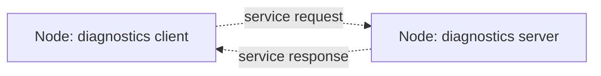

# Lesson 5 Services

## Lesson Goal

By the end of this lesson, you will be able to create a ROS 2 service server, call it from the command line, call it from Python, and explain when a service is a better fit than a topic.

## Why This Matters

In Lesson 4, you used **topics** for repeated fake IMU tilt data. That is perfect for information that keeps flowing again and again.

Sometimes a robot does not need a stream. Sometimes one node needs to ask another node a direct question:

- "Run diagnostics now."
- "Is the battery okay?"
- "Can I reset this rover state?"
- "Are the motors ready?"

That direct question-and-answer pattern is what ROS 2 **services** are for.

This lesson stays low-storage friendly. You only need ROS 2 Jazzy, your `~/ros2_ws` workspace, your existing `rover_core` Python package, and terminals. You do **not** need Gazebo, Navigation2, MoveIt, Docker, YOLO, AI packages, large simulation worlds, or a full desktop robotics stack.

## Before You Start

You need:

- Ubuntu 24.04 LTS with ROS 2 Jazzy installed.
- The `~/ros2_ws` workspace from Lesson 1.
- The `rover_core` Python package from Lesson 1 and Lesson 2.
- Basic comfort running ROS 2 Python nodes.
- Two terminals; a third terminal is helpful for inspection.
- A text editor such as `nano`, VS Code, or another editor you like.

Each terminal that uses ROS 2 needs to be sourced:

```bash
source /opt/ros/jazzy/setup.bash
source ~/ros2_ws/install/setup.bash
```

> **Beginner reminder**
>
> `source` usually prints nothing when it succeeds. Quiet output is normal. To check the ROS 2 distribution, run `echo $ROS_DISTRO`. It should print `jazzy`.

## New Words

**Service:** A named ROS 2 communication path for one request and one response.

- **It is:** a way for one node to ask another node for something once.
- **It is not:** a continuous stream of data.
- **Tiny rover example:** a diagnostics client asks `/run_diagnostics`, and a diagnostics server replies with `Battery OK, motors OK, IMU OK`.
- **Analogy:** A topic is like a radio station that keeps broadcasting. A service is like asking a help desk one question and getting one answer.

**Service server:** The node that offers the service and answers requests. In this lesson, `diagnostics_server` is the service server.

**Service client:** The node or command that calls the service. In this lesson, `diagnostics_client_minimal`, `diagnostics_client`, and `ros2 service call` can all act as clients.

**Request:** The question or command sent to the service server.

**Response:** The answer sent back by the service server.

**Service type:** The request-and-response shape that both sides agree to use.

**Built-in service interface:** A service type that already comes from ROS 2 packages. This lesson uses `example_interfaces/srv/Trigger`.

> **Student note**
>
> `diagnostics_server` is the node. `/run_diagnostics` is the service offered by that node. A node can offer services, publish topics, subscribe to topics, or do several of these at once.

## Big Idea

A service has two sides: a client asks, and a server answers. The exchange happens once for each call.



This is a **Dann ROS 2 Graph**, the course's beginner-friendly drawing convention. It is not an official ROS 2 standard name.

**How to read this:** rectangles are ROS 2 nodes. Dotted arrows show the service request and service response. The client asks for diagnostics, then the server sends back one answer.

> **Beginner reminder**
>
> Services are not "better topics." They solve a different communication problem. Use topics for repeated streams. Use services for one request and one response.

## Step 1: Inspect the Built-In Trigger Service Type

Open a terminal:

```bash
source /opt/ros/jazzy/setup.bash
ros2 interface show example_interfaces/srv/Trigger
```

Expected output:

```text
---
bool success
string message
```

The line with `---` separates the request part from the response part.

For `Trigger`, the request part is empty. That means the client only says, "Please trigger this action now." The response contains:

- `bool success`: `true` or `false`
- `string message`: a text explanation

> **Future topic**
>
> That's a good question if you are wondering, "Why is the request empty?" We will study custom service files properly in Phase 6, especially Section 6.6: Custom Service, so you do not need to master that yet. For now, the short version is: `Trigger` is useful when the request means "do this now" and the answer can be success plus a short message.

## Step 2: Create the Diagnostics Service Server

Move into your package's Python folder:

```bash
cd ~/ros2_ws/src/rover_core/rover_core
nano diagnostics_server.py
```

Paste this code:

```python
import rclpy
from example_interfaces.srv import Trigger
from rclpy.node import Node


class DiagnosticsServer(Node):
    def __init__(self):
        super().__init__('diagnostics_server')
        self.service = self.create_service(
            Trigger,
            '/run_diagnostics',
            self.run_diagnostics_callback,
        )
        self.get_logger().info('Diagnostics service is ready.')

    def run_diagnostics_callback(self, request, response):
        response.success = True
        response.message = 'Battery OK, motors OK, IMU OK'
        self.get_logger().info('Diagnostics request received.')
        return response


def main(args=None):
    rclpy.init(args=args)
    node = DiagnosticsServer()

    try:
        rclpy.spin(node)
    except KeyboardInterrupt:
        pass
    finally:
        node.destroy_node()
        rclpy.shutdown()


if __name__ == '__main__':
    main()
```

### What the Important Lines Do

- **`from example_interfaces.srv import Trigger`** imports the built-in service type.
- **`super().__init__('diagnostics_server')`** gives the node its ROS 2 name.
- **`create_service(Trigger, '/run_diagnostics', ...)`** creates a service server that answers calls to `/run_diagnostics`.
- **`run_diagnostics_callback`** runs each time a client calls the service.
- **`response.success = True`** tells the client the diagnostic check succeeded.
- **`response.message = ...`** sends the diagnostic report back as text.
- **`rclpy.spin(node)`** keeps the server alive so it can answer requests.

> **Student note**
>
> The `request` variable is not used in this example because `Trigger` has an empty request. That is okay. The server still receives a request event, then fills in the response.

## Step 3: Register the Server and Build

Open `setup.py`:

```bash
cd ~/ros2_ws/src/rover_core
nano setup.py
```

Inside the existing `console_scripts` list, add this line. Keep your earlier entries from previous lessons:

```python
'diagnostics_server = rover_core.diagnostics_server:main',
```

Build only `rover_core`:

```bash
cd ~/ros2_ws
colcon build --packages-select rover_core
source install/setup.bash
```

`colcon build` updates the installed package files. `source install/setup.bash` refreshes this terminal so ROS 2 can find the new executable.

**Success sign:** the build summary shows `rover_core` finished without errors.

## Step 4: Run the Service Server

In Terminal 1, run:

```bash
source /opt/ros/jazzy/setup.bash
source ~/ros2_ws/install/setup.bash
ros2 run rover_core diagnostics_server
```

Expected output:

```text
[INFO] ... Diagnostics service is ready.
```

Leave this terminal running. The service only exists while the server node is alive.

> **Important**
>
> If you press `Ctrl+C` in the server terminal, `/run_diagnostics` disappears because the node offering it stopped.

## Step 5: Inspect the Service from Another Terminal

In Terminal 2, source ROS 2 and your workspace:

```bash
source /opt/ros/jazzy/setup.bash
source ~/ros2_ws/install/setup.bash
```

List running nodes:

```bash
ros2 node list
```

Expected success sign:

```text
/diagnostics_server
```

Now list services:

```bash
ros2 service list
```

Expected success sign: `/run_diagnostics` appears. You will also see built-in services such as parameter services. That is normal.

Ask ROS 2 for the service type:

```bash
ros2 service type /run_diagnostics
```

Expected output:

```text
example_interfaces/srv/Trigger
```

This proves that `/run_diagnostics` is using the same `Trigger` service type you inspected earlier.

## Step 6: Call the Service from the Command Line

Still in Terminal 2, run:

```bash
ros2 service call /run_diagnostics example_interfaces/srv/Trigger "{}"
```

Expected output:

```text
requester: making request: example_interfaces.srv.Trigger_Request()

response:
example_interfaces.srv.Trigger_Response(success=True, message='Battery OK, motors OK, IMU OK')
```

The exact formatting may vary slightly, but the important success signs are:

- `success=True`
- `Battery OK, motors OK, IMU OK`

The `"{}"` part is an empty YAML request. It looks strange at first, but it matches the empty request section of `Trigger`.

> **Student note**
>
> `ros2 service call` is acting like a temporary client. This is useful because you can test a service before writing Python client code.

## Step 7: Create a Minimal Python Service Client

Now you will create a client node that calls the same service from Python.

Create the file:

```bash
cd ~/ros2_ws/src/rover_core/rover_core
nano diagnostics_client_minimal.py
```

Paste this code:

```python
import rclpy
from example_interfaces.srv import Trigger


def main(args=None):
    rclpy.init(args=args)

    node = rclpy.create_node('diagnostics_client_minimal')
    client = node.create_client(Trigger, '/run_diagnostics')

    while not client.wait_for_service(timeout_sec=1.0):
        node.get_logger().info('service not available, waiting again...')

    request = Trigger.Request()
    future = client.call_async(request)
    rclpy.spin_until_future_complete(node, future)

    response = future.result()
    node.get_logger().info(
        f'Diagnostics result: success={response.success}, message="{response.message}"'
    )

    node.destroy_node()
    rclpy.shutdown()


if __name__ == '__main__':
    main()
```

### What the Important Lines Do

- **`rclpy.create_node('diagnostics_client_minimal')`** creates a simple ROS 2 node without a class.
- **`create_client(Trigger, '/run_diagnostics')`** creates a client for the `/run_diagnostics` service.
- **`wait_for_service(timeout_sec=1.0)`** checks whether the server is available before calling it.
- **`Trigger.Request()`** creates the request object. It has no fields because `Trigger` has an empty request.
- **`call_async(request)`** sends the request without freezing all ROS 2 processing.
- **`future`** is the object that will hold the response when it arrives.
- **`spin_until_future_complete(node, future)`** keeps the node active until the response is ready.

> **Beginner reminder**
>
> A service client can be short-lived. It is normal for this client to ask one question, print one answer, and exit.

## Step 8: Register and Run the Minimal Client

Open `setup.py`:

```bash
cd ~/ros2_ws/src/rover_core
nano setup.py
```

Add this console script entry:

```python
'diagnostics_client_minimal = rover_core.diagnostics_client_minimal:main',
```

Build and source:

```bash
cd ~/ros2_ws
colcon build --packages-select rover_core
source install/setup.bash
```

Make sure Terminal 1 is still running the server:

```bash
ros2 run rover_core diagnostics_server
```

In Terminal 2, run the client:

```bash
ros2 run rover_core diagnostics_client_minimal
```

Expected output:

```text
[INFO] ... Diagnostics result: success=True, message="Battery OK, motors OK, IMU OK"
```

If the server is not running, the client will print:

```text
service not available, waiting again...
```

That message is not automatically a failure. It means the client is waiting because it cannot see the server yet.

## Step 9: Create a Class-Based Service Client

The minimal client is useful for learning the smallest flow. A class-based client is easier to reuse when the program grows.

Create the file:

```bash
cd ~/ros2_ws/src/rover_core/rover_core
nano diagnostics_client.py
```

Paste this code:

```python
import rclpy
from example_interfaces.srv import Trigger
from rclpy.node import Node


class DiagnosticsClient(Node):
    def __init__(self):
        super().__init__('diagnostics_client')
        self.client = self.create_client(Trigger, '/run_diagnostics')

    def send_request(self):
        while not self.client.wait_for_service(timeout_sec=1.0):
            self.get_logger().info('service not available, waiting again...')

        request = Trigger.Request()
        return self.client.call_async(request)


def main(args=None):
    rclpy.init(args=args)
    node = DiagnosticsClient()

    future = node.send_request()
    rclpy.spin_until_future_complete(node, future)

    response = future.result()
    node.get_logger().info(
        f'Diagnostics result: success={response.success}, message="{response.message}"'
    )

    node.destroy_node()
    rclpy.shutdown()


if __name__ == '__main__':
    main()
```

### Why This Version Exists

This client does the same job as the minimal client, but the service-calling behavior is organized inside a class.

That matters because real robot tools often grow:

- one method may call diagnostics;
- another method may reset a subsystem;
- another method may ask for calibration.

You do not need to build all of that now. This lesson only shows the reusable pattern.

## Step 10: Register and Run the Class-Based Client

Open `setup.py` again:

```bash
cd ~/ros2_ws/src/rover_core
nano setup.py
```

Add this console script entry:

```python
'diagnostics_client = rover_core.diagnostics_client:main',
```

Build and source:

```bash
cd ~/ros2_ws
colcon build --packages-select rover_core
source install/setup.bash
```

Make sure the server is running in Terminal 1. Then run:

```bash
ros2 run rover_core diagnostics_client
```

Expected output:

```text
[INFO] ... Diagnostics result: success=True, message="Battery OK, motors OK, IMU OK"
```

You have now called the same service three ways:

- with `ros2 service call`;
- with a minimal Python client;
- with a class-based Python client.

## Step 11: Verify It with ROS 2 CLI

With `diagnostics_server` running, use these checks:

```bash
ros2 node list
ros2 service list
ros2 service type /run_diagnostics
ros2 service call /run_diagnostics example_interfaces/srv/Trigger "{}"
```

Expected success signs:

- `/diagnostics_server` appears in `ros2 node list`.
- `/run_diagnostics` appears in `ros2 service list`.
- `ros2 service type /run_diagnostics` prints `example_interfaces/srv/Trigger`.
- The service call returns `success=True`.
- The response message mentions your rover checks.

Now press `Ctrl+C` in the server terminal and run:

```bash
ros2 service list
```

Expected success sign: `/run_diagnostics` no longer appears.

That disappearing service is useful evidence. It proves the service belongs to the running server node.

## Common Mistakes

- **Running the client before the server:** Start `diagnostics_server` first, then run the client.
- **Forgetting to source a new terminal:** Every terminal needs `source /opt/ros/jazzy/setup.bash` and usually `source ~/ros2_ws/install/setup.bash`.
- **Forgetting to rebuild after editing `setup.py`:** New console scripts are not available until you rebuild and source again.
- **Confusing node name and service name:** `diagnostics_server` is the node. `/run_diagnostics` is the service.
- **Typing the service type wrong:** Use `ros2 service type /run_diagnostics` and copy the exact result.
- **Forgetting `"{}"` in the CLI call:** `Trigger` has an empty request, but the CLI still needs an empty request value.
- **Expecting the client to keep running:** One-shot clients often ask, receive, print, and exit.
- **Expecting a service to stream updates forever:** That is a topic job, not a service job.

## Troubleshooting

| Symptom | Likely cause | Fix | How to verify |
|---|---|---|---|
| `ros2: command not found` | ROS 2 was not sourced in this terminal | Run `source /opt/ros/jazzy/setup.bash` | `ros2 --help` prints help text |
| `Package 'rover_core' not found` | Workspace was not built or sourced | Run `cd ~/ros2_ws`, build, then source `install/setup.bash` | `ros2 pkg list | grep rover_core` prints `rover_core` |
| `No executable found` | Console script entry point is missing or package was not rebuilt | Check `setup.py`, rebuild, and source again | `ros2 run rover_core diagnostics_server` starts |
| `/run_diagnostics` does not appear | Server is not running or crashed | Start the server in a sourced terminal | `ros2 service list` shows `/run_diagnostics` |
| CLI call complains about the type | Service type was mistyped | Run `ros2 service type /run_diagnostics` and copy the exact type | The call uses `example_interfaces/srv/Trigger` |
| Client waits forever | Server is not running or service name does not match | Start the server and confirm the service name | Client stops waiting and prints the response |
| Python import error mentions `example_interfaces` | ROS 2 environment is not sourced or package install is broken | Source `/opt/ros/jazzy/setup.bash` and rebuild if needed | `ros2 interface show example_interfaces/srv/Trigger` works |
| `rqt_graph` does not show the client | The client finishes quickly | Use CLI checks as the main proof | `ros2 service call` and client output succeed |

## Simple Exercise or Mini-Project

**Mini-project name:** Diagnostics Ask-And-Answer

**Task:** Modify your diagnostics service so the response message includes at least three rover checks of your choice.

Required parts:

- A service server named `diagnostics_server`.
- A service named `/run_diagnostics`.
- A successful response using `success=True`.
- A message that mentions at least three checks, such as battery, motors, IMU, wheels, camera mount, or emergency stop.
- One successful CLI service call.
- One successful Python client call.

Success criteria:

- `ros2 node list` shows `/diagnostics_server`.
- `ros2 service list` shows `/run_diagnostics`.
- `ros2 service type /run_diagnostics` prints `example_interfaces/srv/Trigger`.
- `ros2 service call /run_diagnostics example_interfaces/srv/Trigger "{}"` returns your updated message.
- `ros2 run rover_core diagnostics_client_minimal` prints your updated message.
- You can explain why this is a service instead of a topic in one or two minutes.

Optional hint:

- Only change the `response.message` text first. Rebuild and source after editing.

What you should decide on your own:

- Which rover checks belong in your diagnostic message.
- Whether the message sounds like a real robot status report.

One-minute explanation prompt:

- What did the client request?
- What did the server return?
- How did the CLI prove the service existed?
- Why is `/run_diagnostics` a good service example?

## Recap

- A **service** is for one request and one response.
- A **service server** offers the service and answers requests.
- A **service client** calls the service.
- `example_interfaces/srv/Trigger` is useful for simple "do this now" actions.
- `ros2 service call` lets you test a service without writing Python client code.
- A service disappears from `ros2 service list` when the node offering it stops.

## Checkpoint Questions

- What is the difference between a topic and a service?
- In this lesson, which node is the service server?
- Which node or command acts as the service client?
- What does `/run_diagnostics` name: a node, a topic, or a service?
- Why does the client wait for the service before sending a request?
- What does `example_interfaces/srv/Trigger` define?
- Why is `ros2 service call` useful before writing a Python client?
- What should disappear from `ros2 service list` when the server stops?
