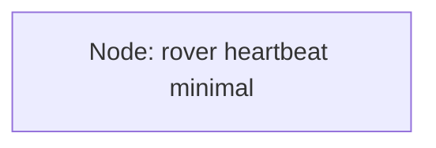

# Phase 2 Lesson 2 Python Node, Minimal Code First

## Lesson Goal

By the end of this lesson, you will be able to create the smallest useful Python ROS 2 node in the `rover_core` package, run it with `ros2 run`, and verify that ROS 2 can see it while it is alive.

## Why This Matters

A ROS 2 robot is usually built from many small programs called **nodes**.

For a rover, one node might report a heartbeat, another might read an IMU, another might listen for motor commands, and another might answer diagnostic requests. Before we connect nodes with topics, services, parameters, or launch files, we need one tiny node that starts correctly and stays alive.

This lesson keeps the code procedural on purpose. No classes yet. The goal is to understand the smallest moving parts before learning the common class-based ROS 2 pattern in the next section.

## Before You Start

You need:

- Ubuntu 24.04 LTS.
- ROS 2 Jazzy base installed.
- The `~/ros2_ws` workspace from Lesson 1.
- The `rover_core` Python package from Lesson 1.
- A terminal inside Ubuntu.
- A text editor such as VS Code, nano, or another editor you are comfortable with.

This lesson is low-storage friendly. You do not need Gazebo, Navigation2, MoveIt, Docker, YOLO, AI packages, large simulation worlds, or the full ROS desktop stack.

> **Important**
>
> Run the ROS 2 commands inside Ubuntu. If you are using macOS plus an Ubuntu VM, use macOS for editing course notes if you want, but run and build the ROS 2 workspace inside Ubuntu.

## New Words

**Node:** A running ROS 2 program with one focused job. In this lesson, the node's job is to say that the rover core is still alive.

**Not a node:** A package is not a node. A package is a folder of related code and metadata. A node is a program that actually runs.

> **Student note**
>
> A package can contain related nodes, like tools that belong to the same rover system. Those nodes are not connected automatically just because they are in the same package; they work together only when we connect them later with ROS 2 communication such as topics, services, parameters, or launch files.

**Tiny rover example:** `rover_core` is the package. `rover_heartbeat_minimal` is the node inside that package.

**`rclpy`:** The Python library for writing ROS 2 nodes. It lets Python code join the ROS 2 system.

**`rclpy.init()`:** Starts the ROS 2 Python client library for this program.

**Create a node:** In Python, `rclpy.create_node("name")` creates a ROS 2 node object with a name.

**Logger:** A ROS 2-friendly way to print messages. Instead of normal `print()`, ROS 2 nodes often use `node.get_logger().info(...)`.

**Spin:** Let ROS 2 process work for a node. Later, spinning will let callbacks receive topic messages, service requests, timer events, and more.

**Shutdown:** Cleanly stop the ROS 2 Python client library when the program exits.

**Console script:** A named command registered in `setup.py` so ROS 2 can run your Python file using `ros2 run`.

> **Student note**
>
> Spinning may feel strange in this lesson because our node does not subscribe to anything yet. That is normal. For now, think of spinning as giving ROS 2 time to keep the node alive and ready. It will make more sense after topics and services.

## Big Idea

A minimal Python ROS 2 node needs a small startup and shutdown pattern:

1. Start ROS 2 for Python.
2. Create a node with a name.
3. Do useful work.
4. Let ROS 2 spin while the node is alive.
5. Destroy the node and shut down cleanly.

In this lesson, the useful work is simple: log a heartbeat message every second.

Here is the small system you are building:



**How to read this:** There is only one node. There are no topics, services, parameters, or launch files yet.

> **Beginner reminder**
>
> This is a very small Dann ROS 2 Graph. Dann ROS 2 Graph is this course's beginner drawing convention, not an official ROS 2 standard name. In this lesson, the graph is intentionally tiny because we are learning how to make one node run.

## Step 1: Open a Fresh Ubuntu Terminal

Open a terminal inside Ubuntu.

Check that ROS 2 Jazzy is visible:

```bash
echo $ROS_DISTRO
```

Expected output:

```text
jazzy
```

If the output is blank, source ROS 2 manually:

```bash
source /opt/ros/jazzy/setup.bash
```

This command usually prints nothing when it works. That is normal.

## Step 2: Go to Your Workspace

Move into the workspace root:

```bash
cd ~/ros2_ws
```

Check that the package from Lesson 1 exists:

```bash
ls src/rover_core
```

Expected success signs:

- You see files such as `package.xml` and `setup.py`.
- You see a Python folder named `rover_core`.

If `src/rover_core` does not exist, return to Lesson 1 and create the package first.

## Step 3: Create the Minimal Node File

Move into the Python module folder inside the package:

```bash
cd ~/ros2_ws/src/rover_core/rover_core
```

Create a new Python file:

```bash
nano rover_heartbeat_minimal.py
```

Paste this code:

```python
import rclpy


def main(args=None):
    rclpy.init(args=args)

    node = rclpy.create_node("rover_heartbeat_minimal")

    try:
        while rclpy.ok():
            node.get_logger().info("Rover heartbeat: core system is alive")
            rclpy.spin_once(node, timeout_sec=1.0)
    except KeyboardInterrupt:
        pass
    finally:
        node.destroy_node()
        if rclpy.ok():
            rclpy.shutdown()


if __name__ == "__main__":
    main()
```

Save and exit nano:

- Press `Ctrl+O`, then `Enter` to save.
- Press `Ctrl+X` to exit.

### What the Important Lines Do

`import rclpy` loads the Python ROS 2 library.

`rclpy.init(args=args)` prepares this Python program to use ROS 2.

`rclpy.create_node("rover_heartbeat_minimal")` creates a node named `rover_heartbeat_minimal`.

`node.get_logger().info(...)` prints a ROS 2 log message.

`while rclpy.ok():` keeps the node running while ROS 2 is healthy.

`rclpy.spin_once(node, timeout_sec=1.0)` gives ROS 2 one chance to process work, then waits up to one second. In this lesson, that one-second wait also controls the heartbeat timing.

`KeyboardInterrupt` catches `Ctrl+C` so stopping the node does not look like a scary crash.

`node.destroy_node()` cleans up the node.

`if rclpy.ok():` checks whether ROS 2 is still running before trying to shut it down. This prevents an error if ROS 2 already started shutting down after `Ctrl+C`.

`rclpy.shutdown()` cleanly shuts down ROS 2 for this Python program when shutdown is still needed.

> **Student note**
>
> This is not the only way to write a heartbeat node. In the next lesson, you will learn the class-based version with a ROS 2 timer. For now, this procedural version helps you see the startup and shutdown pattern clearly.

> **Vibe coding prompt tip**
>
> If you only want help with this step, ask: "Create a ROS 2 Jazzy Python node named `rover_heartbeat_minimal` that logs a heartbeat message every second so I can track that this node is active. Only give me the Python node file for Step 3." Ask for `setup.py`, build, run, and verification commands only when you want the full workflow. This is needed so our node that we created can be run in setup.py. More info in next Step on why we should prompt this part. 

## Step 4: Register the Node as a Console Script

ROS 2 needs to know which Python function should run when you type a `ros2 run` command.

Open `setup.py`:

```bash
cd ~/ros2_ws/src/rover_core
nano setup.py
```

Find the `entry_points` section. It may look close to this:

```python
entry_points={
    'console_scripts': [
    ],
},
```

Add this line inside the `console_scripts` list:

```python
'rover_heartbeat_minimal = rover_core.rover_heartbeat_minimal:main',
```

The finished section should look like this:

```python
entry_points={
    'console_scripts': [
        'rover_heartbeat_minimal = rover_core.rover_heartbeat_minimal:main',
    ],
},
```

Save and exit.

This line means:

- `rover_heartbeat_minimal` is the command name.
- `rover_core.rover_heartbeat_minimal` points to the Python file.
- `main` is the function ROS 2 should call.

> **Student note**
>
> You can think of the console script line as a registered command or alias: rover_heartbeat_minimal is the command name, and rover_core.rover_heartbeat_minimal:main is the real Python location it points to. You normally run the short registered command with ros2 run rover_core rover_heartbeat_minimal, not the full Python path.

## Step 5: Build the Workspace

Move back to the workspace root:

```bash
cd ~/ros2_ws
```

Build:

```bash
colcon build --packages-select rover_core
```

This tells `colcon` to build only the `rover_core` package.

Expected success signs:

- You see `Starting >>> rover_core`.
- You see `Finished <<< rover_core`.
- The final summary does not show failed packages.

If the build fails, read the error carefully. Python indentation, missing commas in `setup.py`, and misspelled file names are common at this stage.

## Step 6: Source the Workspace

After building, source the local workspace:

```bash
source install/setup.bash
```

This command teaches the current terminal about the updated `rover_core` package and its new console script.

It usually prints nothing when it works. Blank output is normal.

## Run It

Run the node:

```bash
ros2 run rover_core rover_heartbeat_minimal
```


Expected output will look similar to this:

```text
[INFO] [1234567890.123456789] [rover_heartbeat_minimal]: Rover heartbeat: core system is alive
[INFO] [1234567891.123456789] [rover_heartbeat_minimal]: Rover heartbeat: core system is alive
[INFO] [1234567892.123456789] [rover_heartbeat_minimal]: Rover heartbeat: core system is alive
```

Your timestamps will be different. That is okay.

The important success signs are:

- A new message appears about once per second.
- The node name in the log is `rover_heartbeat_minimal`.
- The program keeps running until you stop it.

Stop it with:

```bash
Ctrl+C
```

## Verify It

To verify the node with ROS 2 CLI, use two terminals.

### Terminal 1

Source ROS 2 and the workspace:

```bash
source /opt/ros/jazzy/setup.bash
cd ~/ros2_ws
source install/setup.bash
```

Run the heartbeat node:

```bash
ros2 run rover_core rover_heartbeat_minimal
```

Leave it running.

### Terminal 2

Open a second Ubuntu terminal and source ROS 2:

```bash
source /opt/ros/jazzy/setup.bash
cd ~/ros2_ws
source install/setup.bash
```

List running nodes:

```bash
ros2 node list
```

Expected output:

```text
/rover_heartbeat_minimal
```

Now inspect the node:

```bash
ros2 node info /rover_heartbeat_minimal
```

Expected success signs:

- ROS 2 finds the node.
- You see the node name.
- You may see sections for subscribers, publishers, services, and clients.

It is okay if this node does not show your own custom topics yet. Topics begin in Phase 4.

> **Future-topic note**
>
> That's a good question if you are wondering why `ros2 node info` shows publishers or services even though we did not create any. We will study topics in Phase 4 and services in Phase 5, so you do not need to master that yet. For now, the short version is that ROS 2 nodes often have a few built-in communication pieces for internal ROS 2 behavior. In this lesson, focus on proving that your node starts, stays alive, and appears in `ros2 node list`.

## Common Mistakes

- **Forgetting to source ROS 2:** If `ros2` says `command not found`, run `source /opt/ros/jazzy/setup.bash`.
- **Forgetting to source the workspace:** If `ros2 run` cannot find `rover_core` or `rover_heartbeat_minimal`, run `cd ~/ros2_ws` and `source install/setup.bash`.
- **Building from the wrong folder:** Run `colcon build` from `~/ros2_ws`, not from `~/ros2_ws/src` and not from inside the package folder.
- **Missing comma in `setup.py`:** Console script lines inside a Python list need commas between items.
- **Wrong Python module path:** The entry point should use `rover_core.rover_heartbeat_minimal:main`, not the full file path.
- **Expecting the node to exit by itself:** This node is supposed to keep running until you press `Ctrl+C`.
- **Looking for topics too early:** This lesson creates a node only. Custom topic communication starts later.

## Troubleshooting

| Symptom | Likely cause | Fix | How to verify |
|---|---|---|---|
| `ros2: command not found` | ROS 2 is not sourced in this terminal | Run `source /opt/ros/jazzy/setup.bash` | `echo $ROS_DISTRO` prints `jazzy` |
| `Package 'rover_core' not found` | Workspace is not sourced or package was not built | Run `cd ~/ros2_ws`, `colcon build --packages-select rover_core`, then `source install/setup.bash` | `ros2 pkg list \| grep rover_core` prints `rover_core` |
| `No executable found` | Console script was not added correctly or workspace was not rebuilt | Check `setup.py`, rebuild, and source again | `ros2 run rover_core rover_heartbeat_minimal` starts logging |
| Build fails with a Python syntax error | There is a typo, indentation error, or missing comma | Reopen the file named in the error and fix the line shown | `colcon build --packages-select rover_core` finishes successfully |
| `ros2 node list` does not show the node | The node is not running, or Terminal 2 is not sourced | Keep Terminal 1 running the node, then source Terminal 2 | `ros2 node list` shows `/rover_heartbeat_minimal` |
| The heartbeat prints too fast or too slowly | The `timeout_sec` value was changed | Use `timeout_sec=1.0` for about one message per second | Watch the log timing for several messages |
| `rcl_shutdown already called` appears after `Ctrl+C` | The code tried to shut down ROS 2 after it was already shutting down | Use `if rclpy.ok():` before `rclpy.shutdown()` | The node stops cleanly after `Ctrl+C` |

## Simple Exercise or Mini-Project

### Mini-Project: Rover Status Beacon

Create a second minimal node called:

```text
rover_status_beacon
```

**Goal:** The node should print a simple status message every two seconds.

**Requirements:**

- Create a new Python file in `~/ros2_ws/src/rover_core/rover_core/`.
- Register it in `setup.py` as a console script.
- Use a node name that matches the system idea, such as `rover_status_beacon`.
- Log a message that includes the word `status`.
- Make the loop wait about two seconds between messages.
- Build, source, run, and verify it with `ros2 node list`.

**Success criteria:**

- `ros2 run rover_core rover_status_beacon` starts the node.
- A status message appears about every two seconds.
- `ros2 node list` shows `/rover_status_beacon` while it is running.

**Optional hint:**

Use the heartbeat node as your pattern, but change the file name, node name, console script name, message text, and `timeout_sec`.

**What you should decide on your own:**

- The exact status message.
- Whether the status message sounds like a battery check, system check, or readiness check.

After it works, explain your design in one or two minutes:

- What is the package?
- What is the node?
- What command runs it?
- How did you prove ROS 2 could see it?

## Recap

- A ROS 2 node is a running program with a focused job.
- `rclpy.init()` starts ROS 2 support for Python.
- `rclpy.create_node(...)` creates a named ROS 2 node.
- ROS 2 logging is better than plain `print()` for node messages.
- `spin_once` gives ROS 2 time to process node work.
- `setup.py` registers a Python function so `ros2 run` can start it.
- `colcon build` and `source install/setup.bash` are needed after changing console scripts.

## Checkpoint Questions

- What is the difference between the `rover_core` package and the `rover_heartbeat_minimal` node?
- Why do you need to rebuild after changing `setup.py`?
- What does `source install/setup.bash` do after a build?
- How can you prove a node is alive using ROS 2 CLI?
- Why does this lesson avoid classes even though many ROS 2 nodes use classes?
